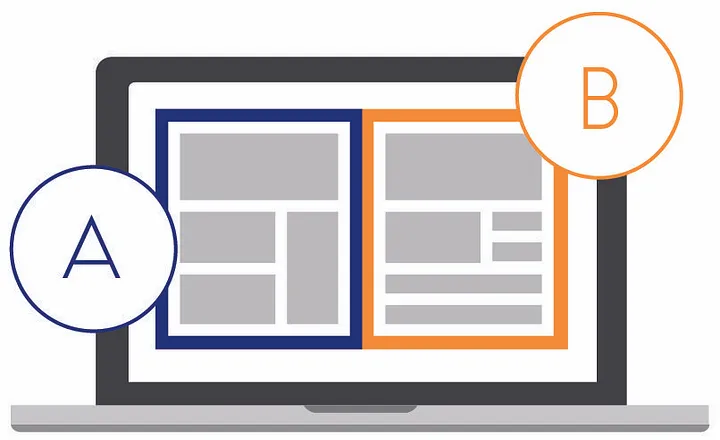
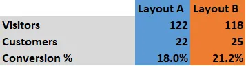

[Source Article](https://michael-bar.github.io/Introduction-to-statistics/AMP-2-RCT-principles.html)

# Defining hypothesis - Principles of A/B Testing

## The Amazon Example

Imagine you’re the CEO of Amazon, trying to determine if rearranging your website into a new format affects the conversion rate (the proportion of visitors who become customers). 

### Simple Approach
One approach could be running both versions (Layout A and Layout B) with selected customers and making judgments based on the observed numbers. In such a case, you might conclude that Layout B is superior to Layout A.

### Starting with a Hypothesis

A hypothesis is a formal statement describing the relationship under test. It contrasts a control sample (e.g., Layout A) with a treatment sample (e.g., Layout B).

#### Example
- **Null Hypothesis (H₀)**: No difference between Layout A and Layout B in conversion rates.
- **Alternative Hypothesis (H₁)**: Layout B has a higher conversion rate than Layout A.

### About the A/B method name 
The term **A/B testing** (read A or B and not A given B) originates from the methodology of comparing two variations—**A** and **B**—to determine which performs better with respect to a specific metric or outcome. Here’s why it’s called A/B testing:

1. **Two Versions (A and B)**:
   - **A**: The **control group**, representing the original or current version of a product, website, or strategy.
   - **B**: The **treatment group**, representing the new or modified version being tested.

2. **Simple and Direct Comparison**:
   - The name reflects the binary nature of the test, which involves a straightforward comparison between two distinct choices to identify the better-performing option.

### Null Hypothesis (H₀) → **A (Control)**
- The null hypothesis assumes **no significant difference** between the two groups. Which means True (H₀) → A. 
- In an A/B test, this corresponds to the belief that the control group (A) performs the same as or better than the treatment group (B).
- Example: "The conversion rate of Layout B is not significantly different from Layout A."

### Alternative Hypothesis (H₁) → **B (Treatment)**
- The alternative hypothesis posits that there **is a significant difference** between the groups. Which means True (H₁) → B.
- In an A/B test, this aligns with the idea that the treatment group (B) has a different (often better) performance than the control group (A).
- Example: "The conversion rate of Layout B is significantly higher than Layout A."

### Why This Analogy Works:
- **A** (control) represents the status quo or baseline, which aligns with the null hypothesis that assumes no change or effect.
- **B** (treatment) represents the new idea or intervention, which aligns with the alternative hypothesis that suggests a measurable difference.

### However:
While this analogy is useful for understanding the relationship, it's important to note that:
- The null and alternative hypotheses are statistical constructs and are not inherently tied to specific labels like "A" or "B."
- In practice, hypotheses are based on the **measured outcomes** (e.g., conversion rates) rather than the labels of the groups.

---

# A/B Testing: A Powerful Tool for Product Development

The humble A/B test, also known as a randomized controlled trial (RCT) in other sciences, is a powerful tool for product development. It provides a highly accurate method for estimating effect size (and ROI) while also offering causality—a rare achievement in data science. This allows us to settle the “correlation vs causation” debate and prove the effectiveness of new products.

### Issues with This Approach
This simple method is prone to:
- **Type I Error or False Positive**: Falsely concluding the intervention was successful (e.g., Layout B is better than Layout A), also known as a false positive. for example: Layout B make a difference when actually it doesn't. False positive. Positive wrt to our alternate hypothesis.   
- **Type II Error or False Negative**: Falsely concluding the intervention was not successful, also known as a false negative. FOr example, if we have said Layout-B doesn't make a difference when actually it does. - False negative, Negative wrt our hypothesis.

These errors occur because we’re trying to draw conclusions about a population (all Amazon customers) from a sample (trial participants). An A/B test helps quantify effect size and errors, calculating the probability of these errors. Only after understanding the effect size and robustness of results should business-impact decisions, such as estimating ROI, be made.

## Enter Statistics

# PICOT Framework
A well-formed hypothesis follows the **PICOT** framework:
- **Population**: Amazon.com visitors.
- **Intervention**: Layout B.
- **Comparison**: Layout A.
- **Outcome**: Conversion rate.
- **Time**: End of visit.

Weak hypotheses lack clarity, such as undefined terms or poorly specified outcomes.

We can contrast this with a weak hypothesis from an agricultural context, such as:

- **H0:** Banks with nicer colours will not effect loan repayment
- **H1:** Banks with nicer colours will effect loan repayment

Why is this so bad? Take a moment to think before reading on.
- There is no clear definition of “nicer colours”, my nice and your nice might not match. This is an example of a poor intervention definition from PICOT
- What banks? Where, and what level? Do we mean bank branches, if so, are we studying all branches around the world or just those in Manchester city centre? This is a poor population specification
- How are we measuring this? Loan default rates, days past due, total branch losses? This is an example of outcome specification from PICOT.

A strong hypothesis will hold the A/B test together and provide guidance on the design and analysis. You can see that the above hypothesis is useless for these tasks.

This post outlines the design principles of A/B tests and how to ensure trials are effective and cost-efficient. It builds on concepts like statistical power and p-values. A/B testing is also foundational in fields like:
- **Medicine**: Understanding drug efficacy.
- **Economics**: Analyzing human behavior.
- **Foreign Aid**: Evaluating intervention effectiveness.

---

### Randomization

After forming a hypothesis, consider randomization strategies:
1. **Randomly assign visitors to Layout A or Layout B.**
2. **Allow visitors to opt-in to new layouts.**

#### Why Randomize?
- **Distribute Co-variates Evenly**: Factors like geolocation, gender, or risk appetite are balanced between groups.
- **Eliminate Statistical Bias**: Ensures the sample represents the population.

#### Common Biases
- **Randomization Bias**: Poor randomization creates unbalanced groups (e.g., over-representing Texans in one group).
- **Selection Bias**: Allowing participants to self-select introduces confounding factors (e.g., risk-tolerant users opting for beta layouts).

### Best Practice
Randomly assigning participants ensures co-variates are evenly distributed, enabling causal understanding. Let statistical tools (e.g., R) handle randomization for reproducibility using functions like `set.seed`.

---

By following these principles, A/B tests can provide accurate, reliable insights, driving informed business decisions across industries.
