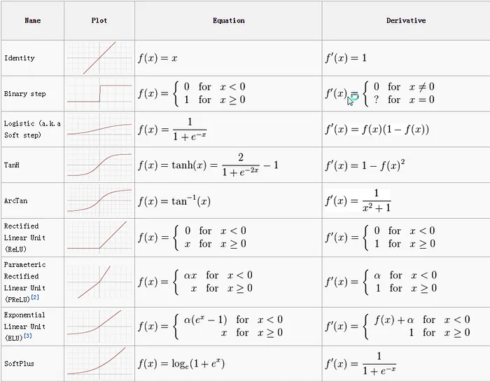

Here's a more readable and visually appealing version of your markdown text:
History says for the large amount of time people were using the sigmoid activation function
Relu was there for a long time but paper in 2009 and 2011 outperformed in their category (AlexNet) due to improved deepmodel training.

---

# Activation Functions in Neural Networks

This guide compares various activation functions and gathers relevant knowledge about them.

## Important Activation Functions

Below is a summary of some popular activation functions used in neural networks, along with their derivatives, which are essential for backpropagation and gradient-based optimization.

### Summary Table:

| Activation Function | Formula                                 | Derivative                                                   |
|---------------------|-----------------------------------------|--------------------------------------------------------------|
| **Sigmoid**          | $\frac{1}{1 + e^{-x}}$                  | $\sigma(x)(1 - \sigma(x))$                                   |
| **tanh**             | \( \frac{e^x - e^{-x}}{e^x + e^{-x}} \) | \( 1 - \text{tanh}^2(x) \)                                   |
| **ReLU**             | \( \max(0, x) \)                        | \( 1 \) if \( x > 0 \), else \( 0 \)                         |
| **Leaky ReLU**       | \( \alpha x \) if \( x \leq 0 \)        | \( 1 \) if \( x > 0 \), else \( \alpha \)                    |
| **Softmax**          | Converts logits to probabilities        | \( \text{Softmax}(z_i)(\delta_{ij} - \text{Softmax}(z_j)) \) |

These activation functions have distinct properties, making them suitable for various problems and architectures.

---

## ReLU Activation Function
Rectified linear units […] are based on the principle that models are easier to optimize if their behavior is closer to linear.
Key to this property is that networks trained with this activation function almost completely avoid the problem of vanishing gradients, as the gradients remain proportional to the node activations.
At first glance, using the ReLU (Rectified Linear Unit) activation function, which outputs the input if it's positive and zero otherwise, seems counterintuitive. After all, why would we use a function that disregards negative values? However, there are key arguments in favor of ReLU:

### Cons of Sigmoid/tanh Activation Functions

1. **Vanishing Gradient Problem**:  
   In large networks, sigmoid and tanh functions suffer from the vanishing gradient problem. As error is backpropagated through layers, the gradient diminishes significantly, preventing deep networks from learning effectively.
   
2. **Saturation**:  
   Both functions saturate—sigmoid snaps large values to 1 and small ones to 0, while tanh snaps large values to 1 and small ones to -1. They are only sensitive to changes near their midpoints, making them inefficient for deeper networks.

---

## Why ReLU Works Better

Despite its simplicity, ReLU introduces important advantages over other activation functions:

1. **Non-linearity**:  
   Although ReLU is linear for positive values, it applies a non-linear, piecewise operation, breaking linearity for negative inputs by outputting zero. This non-linearity allows the network to approximate complex functions.

2. **Sparsity**:  
   ReLU sets negative values to zero, making the network sparser. This can improve efficiency by introducing "dead" neurons that don't activate for certain inputs, leading to lighter computations and faster training.

3. **Avoiding Vanishing Gradient**:  
   Unlike sigmoid and tanh, ReLU doesn't saturate for positive inputs. This helps avoid the vanishing gradient problem, allowing gradients to flow more effectively and speeding up convergence.

4. **Computational Simplicity**:  
   ReLU is computationally simpler, involving just a thresholding operation at zero. This is more efficient in large networks with many layers and neurons.

5. **Biologically Inspired**:  
   ReLU mimics activation patterns in biological neurons, where neurons either activate or stay dormant, reflecting a natural thresholding behavior.

---

### Why ReLU is Better Than No Activation Function

Without an activation function, a neural network would essentially be a linear model, regardless of its depth. Stacking linear layers still results in a linear transformation, severely limiting the model's expressive power. Non-linear activation functions like ReLU allow the network to model **complex, non-linear relationships** between inputs and outputs.

---

### Visualization of ReLU's Effect
- **Before ReLU**: Suppose the network has several linear layers. The input space might undergo linear transformations, but the decision boundary will remain a straight line.
- **After ReLU**: Once ReLU is applied, the linearity is "broken," allowing the layers to introduce bends, kinks, or even more sophisticated changes to the input space. Now, the decision boundary can adapt to more complex shapes, which improves the model's ability to handle complex datasets.

### In Summary:
- ReLU introduces **non-linearity** by breaking the linear relationship for negative inputs, and this non-linearity enables deep networks to learn complex, hierarchical features from the data.
- Without this non-linearity, no matter how many layers or neurons you add, your model is fundamentally just a linear model, which limits its expressiveness and performance on real-world tasks.
---

## The Importance of Non-linearity

Non-linear activation functions like ReLU are crucial because they enable neural networks to model more complex patterns and relationships. Without non-linearity, the model's ability to learn is severely limited.

### Why Non-linearity Matters

Without a non-linear function, even multiple stacked layers would act as a single linear model. This is because stacking linear transformations still results in a linear transformation. Non-linear activations like ReLU break this cycle, enabling the network to model complex relationships that are not possible with linear models alone.

### Example: Linear vs. Non-linear Models

Consider a task where data points lie in a circular pattern. A linear model would struggle to classify this data correctly, as it can only produce straight-line decision boundaries. By introducing ReLU, the network can learn more complex decision boundaries, improving classification accuracy.

---

This restructured text makes it easier to follow and understand the concepts, with headings, lists, and visual breaks improving readability.

### Why Not Use ReLU in the Output Layer?
ReLU is generally not used in the output layer because:
1. It can produce unbounded outputs, which are unsuitable for probabilities.
2. It doesn’t match well with most cost functions designed for regression or classification.

Let me know if you’d like more clarification!