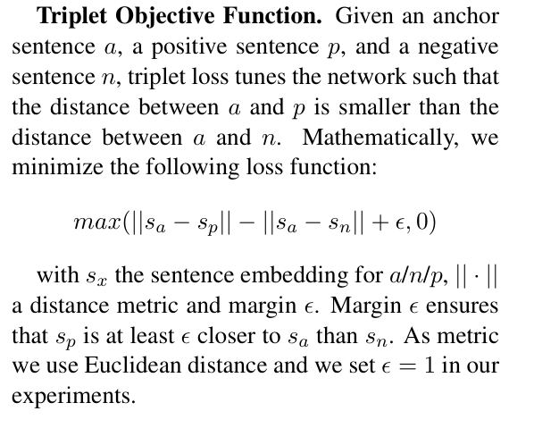

[Chroma DB uses this: SBERT](https://www.sbert.net/)
[Hugging face of Senetence Embedding](https://huggingface.co/sentence-transformers/all-MiniLM-L6-v2)

The basic principle is like the Face-Embedding model where we uses triplet loss from similiar and not similar pairs to train the model.

This require a large dataset to train on, and the model is trained on the triplet loss.

### **How Sentence Embedding Models Are Trained & Their Underlying Concepts**  

Sentence embedding models aim to **map entire sentences into dense vector representations** that capture **semantic meaning**. These embeddings can then be used for tasks like **semantic search, clustering, classification, and similarity detection**.

---

## **1. Key Concepts Behind Sentence Embeddings**
### **A. Word Embeddings (Foundation)**
Before sentence embeddings, word embeddings like **Word2Vec, GloVe, and FastText** were used to represent words as fixed-dimensional vectors. However, these models:
- Do not capture **context** (e.g., "bank" in finance vs. riverbank).
- Treat words **independently**, ignoring sentence structure.

### **B. Contextualized Embeddings (Transformers)**
With the advent of **BERT and Transformer-based models**, embeddings became **context-aware**:
- "I went to the **bank**" (finance context) ≠ "The river **bank** was beautiful."
- These embeddings are **dynamic**, changing based on sentence context.

### **C. Sentence-Level Representations**
Transformers output **token-level embeddings** for each word, but **sentence embeddings** require compressing them into a **single vector**.

---

## **2. Training Methods for Sentence Embeddings**
Sentence embedding models are trained using **self-supervised and supervised learning** techniques. Below are the key approaches:

### **A. Averaging Word Embeddings (Simple Baseline)**
- Computes sentence embeddings as the **average of its word embeddings** (Word2Vec, GloVe).
- **Limitation**: Ignores word order and context.

### **B. Using Transformer Outputs (BERT, GPT, T5)**
- **BERT embeddings**: Extract the `[CLS]` token representation from the final layer.
- **Limitation**: `[CLS]` token may not fully capture sentence meaning.

### **C. Siamese & Triplet Networks (Sentence-BERT - SBERT)**
- **Training Method**: A **Siamese Neural Network** is trained to minimize distance for similar sentences and maximize for different ones.
- **Loss Function**: Uses **Contrastive Loss / Triplet Loss**.
- **Example**:  
  - (Sentence1, Sentence2) → If similar, embeddings should be close.
  - (Sentence1, Sentence3) → If different, embeddings should be far.

### **D. Contrastive Learning (SimCSE)**
- Inspired by **self-supervised learning**.
- Uses **data augmentation** by creating **positive and negative pairs**:
  - **Positive Pair**: Identical sentence but slightly perturbed.
  - **Negative Pair**: Unrelated sentence.
- Uses **InfoNCE Loss** (contrastive loss) to bring **positive pairs closer** and **push negative pairs apart**.

### **E. Unsupervised vs. Supervised Training**
| **Training Type** | **Methodology** | **Example Models** |
|------------------|---------------|----------------|
| **Unsupervised** | Uses augmentation to create similar pairs | SimCSE (self-supervised) |
| **Supervised** | Uses labeled sentence pairs (e.g., entailment data) | SBERT, USE |

---

## **3. Popular Sentence Embedding Models**
### **A. Sentence-BERT (SBERT)**
- **Built on BERT** but fine-tuned using **Siamese networks**.
- **Loss Function**: Triplet Loss / Contrastive Loss.
- **Better than BERT**: Standard BERT embeddings are **not optimized for cosine similarity**, but SBERT is.

### **B. Universal Sentence Encoder (USE)**
- **Google’s model**, based on **Transformer + CNNs**.
- Optimized for **quick similarity computation**.

### **C. SimCSE (Simple Contrastive Sentence Embeddings)**
- Uses **contrastive learning** to improve embeddings.
- Two versions:
  - **Unsupervised SimCSE**: Uses **dropout noise** to create positive pairs.
  - **Supervised SimCSE**: Uses labeled data (like NLI datasets).

### **D. T5 and GPT Variants**
- **T5**: Reformulates tasks as **text-to-text generation**.
- **GPT**: Can be fine-tuned for **sentence embedding tasks**.

---

## **4. How to Use Sentence Embeddings**
Sentence embeddings are widely used in **NLP applications**:

| **Use Case** | **How Sentence Embeddings Help** |
|-------------|----------------------------------|
| **Semantic Search** | Rank documents by similarity to a query |
| **Text Clustering** | Group similar texts together |
| **Question Answering** | Retrieve most relevant answers |
| **Paraphrase Detection** | Detect if two sentences have the same meaning |
| **Machine Translation Evaluation** | Compare translations to original text |

---

## **5. Challenges & Future Directions**
| **Challenge** | **Potential Solution** |
|-------------|------------------|
| Context loss when compressing sentence meaning | Use **attention pooling** instead of simple `[CLS]` |
| Computational cost | Use **DistilBERT-based sentence embeddings** |
| Domain-specific embeddings | Fine-tune on specialized corpora (e.g., legal, medical texts) |

---

### **Conclusion**
- Sentence embedding models are trained using **self-supervised contrastive learning, Siamese networks, or Transformer pooling**.
- **SBERT, SimCSE, and USE** are the most effective sentence embedding models.
- These embeddings power **semantic search, clustering, paraphrase detection, and recommendation systems**.

Would you like code examples for implementing SBERT or SimCSE? 🚀