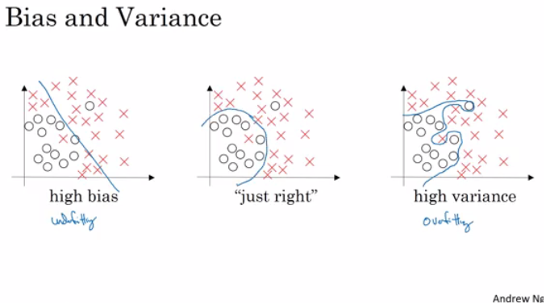

### Bias / Variance

- Bias / Variance techniques are Easy to learn, but difficult to master.
- So here the explanation of Bias / Variance:
  - If your model is underfitting (logistic regression of non linear data) it has a "high bias"
  - If your model is overfitting then it has a "high variance"
  - Your model will be alright if you balance the Bias / Variance
  - For more:
    - 
- Another idea to get the bias /  variance if you don't have a 2D plotting mechanism:
  - High variance (overfitting) for example:
    - Training error: 1%
    - Dev error: 11%
  - high Bias (underfitting) for example:
    - Training error: 15%
    - Dev error: 14%
  - high Bias (underfitting) && High variance (overfitting) for example:
    - Training error: 15%
    - Test error: 30%
  - Best:
    - Training error: 0.5%
    - Test error: 1%
  - These Assumptions came from that human has 0% error. If the problem isn't like that you'll need to use human error as baseline.

### Gist of Notes on Bias/Variance

1. **Definition and Balance**:
   - Bias refers to errors due to overly simplistic assumptions (e.g., underfitting).
   - Variance refers to errors due to excessive sensitivity to training data (e.g., overfitting).
   - A good model balances bias and variance to achieve optimal performance.

2. **Identifying Bias and Variance**:
   - **High Bias (Underfitting)**: Model fails to capture the data's complexity.
     - Example: Logistic regression applied to non-linear data.
   - **High Variance (Overfitting)**: Model captures noise or details irrelevant for generalization.
   - Ideal models balance bias and variance for low error across both training and validation datasets.

3. **Error Analysis**:
   - **High Variance**: Low training error (e.g., 1%), high dev error (e.g., 11%).
   - **High Bias**: Training and dev errors are high and close (e.g., training 15%, dev 14%).
   - **High Bias & High Variance**: Training error is high, and dev error is much higher (e.g., training 15%, dev 30%).
   - **Best Case**: Both training and dev errors are low and close (e.g., training 0.5%, dev 1%).

4. **Human Error Baseline**:
   - Errors are compared against a human baseline (assumed to be 0% in this example). Adjust baselines for problems where humans have non-zero error.

---

Point being:

High Bias: is when model has absolute High error rate in general, showing the model fail to understand the data.

High Variance: is when model has relatively high error in variance compare to training, meaning it has overfitted on the training data.

High Bias and variance: shows model has failed to learn the general pattern in data and unfortunately also overfitted on some of the property due to which it is unable to perform equivalent to the already higher error rate on training dataset.

It has not learned what it is supposed but on contrary learned something, undesirable, which is not a pattern in data.

### Basic Recipe for Machine Learning

- If your algorithm has a high bias:
  - Try to make your NN bigger (size of hidden units, number of layers)
  - Try a different model that is suitable for your data.
  - Try to run it longer.
  - Different (advanced) optimization algorithms.
- If your algorithm has a high variance:
  - More data.
  - Try regularization.
  - Try a different model that is suitable for your data.
- You should try the previous two points until you have a low bias and low variance.
- In the older days before deep learning, there was a "Bias/variance tradeoff". But because now you have more options/tools for solving the bias and variance problem its really helpful to use deep learning.
- Training a bigger neural network never hurts.