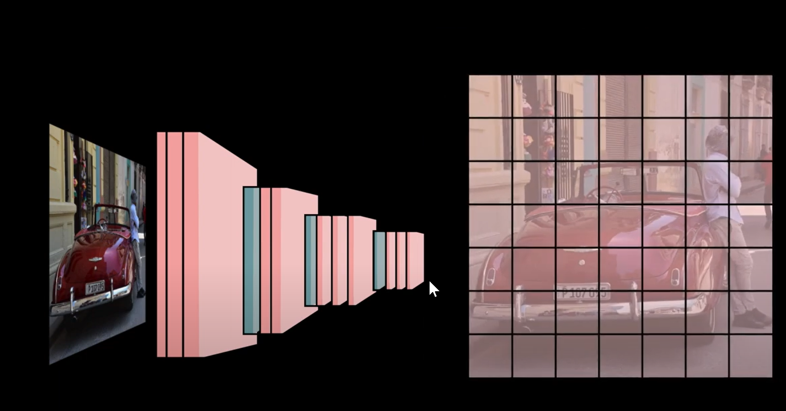

# YOLOX
[Source-1](https://blog.paperspace.com/how-to-implement-a-yolo-object-detector-in-pytorch/) [source-2](https://www.datacamp.com/blog/yolo-object-detection-explained?utm_source=google&utm_medium=paid_search&utm_campaignid=19589720830&utm_adgroupid=152984015734&utm_device=c&utm_keyword=&utm_matchtype=&utm_network=g&utm_adpostion=&utm_creative=724847714833&utm_targetid=aud-1685385913382:dsa-2222697811358&utm_loc_interest_ms=&utm_loc_physical_ms=9197829&utm_content=DSA~blog~Data-Science&utm_campaign=230119_1-sea~dsa~tofu_2-b2c_3-us_4-prc_5-na_6-na_7-le_8-pdsh-go_9-nb-e_10-na_11-na-dec24&gad_source=1&gclid=CjwKCAiAjp-7BhBZEiwAmh9rBXffQ738y7053wLqw3z1H2dPpelwheSQk2R7-YQ060P4GN_dVLbz6xoCqD0QAvD_BwE)\
Building over and above [YOlO - AndrewNG Notes](./DeepLearning.ai-Summary-master/4-%20Convolutional%20Neural%20Networks/Readme.md#object-detection-1)

Yolox is Fully convolution network (FCN) no FC (fully connected) layer hence it is very fast. It utilized identity-convolution to flatten the last layer output.

it divides the image in a grid and gives out prediction for each block of grid using the sliding windows algorithm and as discussed in the Andrew notes, it is much more efficient.

For each block it outputs one-out-block for each anchor. one-out-block (cx, cy, wx, wy, c1 c2 c3..)

in object labelling object is assigned to the anchor with higher IoU so anchor kind of save the spatial information about the general shape (aspect ratio) of object being categorized.

And that's it, that's yolo for you. using 
- Sliding-Windows
- FCN
- Anchor boxes
- NMS
- IoU filtering 

in NMS we are removing same object detected which is not max.
Later in post-processing we have to perform NMS and IoU filtering which is drawback.
---

# R-CNN, Fast-RCNN, Faster RCNN
[Article](https://www.digitalocean.com/community/tutorials/faster-r-cnn-explained-object-detection)
Note: R here stands for Region proposal CNN and not `recurrent`

**Region proposal network**: a network that tells us if any class is present in the given area of image or not, this is checked using FCN that at the end layer tells which blocks contains objects. Detailed are like YOLOX where the last layer only has one output for one proposal layer. From all the proposal where we have detected the object the object is inside it not sure where exactly so the later network take these proposal and tell where exactly are the object of interest located in the original image. In a gist, this network aim is to convolute through the image (generally in a fixed shape convolution) and tell us the region in which there is an object in simple yes or no style. This can be implemented in RCNN, Fast-RCNN and Faster-RCNN

**RCNN** - post first layer RCNN feed all the proposal one by one to the classification network (SVM for k class) and BBOX regressor and hence is very slow in this step (45 second)\
**Fast-RCNN** - This saved computation by using the ROI pooling layer

This is Heavily engineered method from 
- region Proposal 
- ROI pooling layer - in itself a separate paper :/
- FC layer for classification and object location
[Faster-RCNN Paper](https://arxiv.org/pdf/1506.01497v3) [RCNN](https://www.youtube.com/watch?v=5DvljLV4S1E)

- [Salute to this video Level Explanations](https://www.youtube.com/watch?v=itjQT-gFQBY)
Introduced RPN Region proposal network, FPN - Feature Pyramid Network
These all belong to the same family of model, using the same Res-net Backbone for classification but implemented different strategy for object detection problem

Very tough understand all the details skipping but the main things is to understand the three underscore network and their work.
The same has been proposed in the efficentDet for bi-FPN. 

---
### RCNN
The R-CNN consists of 3 main modules:

- The first module generates 2,000 region proposals using the Selective Search algorithm.
- After being resized to a fixed pre-defined size, the second module extracts a feature vector of length 4,096 from each region proposal.
- The third module uses a pre-trained SVM algorithm to classify the region proposal to either the background or one of the object classes.

The R-CNN model has some drawbacks:
- It is a multi-stage model, where each stage is an independent component. Thus, it cannot be trained end-to-end.
- It caches the extracted features from the pre-trained CNN on the disk to later train the SVMs. This requires hundreds of gigabytes of storage.
- R-CNN depends on the Selective Search algorithm for generating region proposals, which takes a lot of time. Moreover, this algorithm cannot be customized to the detection problem.
- Each region proposal is fed independently to the CNN for feature extraction. This makes it impossible to run R-CNN in real-time.

Layer-1: very complex graph based algorithm to propose area of interest 

Layer- 2 & 3: each proposed region one by one is feed to CNN and later to SVM to output region and class

--- 
### Fast-RCNN: [source](https://www.youtube.com/watch?v=pCkxu9958bU)
Fast R-CNN $[2]$ is an object detector that was developed solely by Ross Girshick, a Facebook AI researcher and a former Microsoft Researcher. Fast R-CNN overcomes several issues in R-CNN. As its name suggests, one advantage of the Fast R-CNN over R-CNN is its speed.

Here is a summary of the main contributions in $[2]$:

- Proposed a new layer called ROI Pooling that extracts equal-length feature vectors from all proposals (i.e. ROIs) in the same image.
- Compared to R-CNN, which has multiple stages (region proposal generation, feature extraction, and classification using SVM), Faster R-CNN builds a network that has only a single stage.
- Faster R-CNN shares computations (i.e. convolutional layer calculations) across all proposals (i.e. ROIs) rather than doing the calculations for each proposal independently. This is done by using the new ROI Pooling layer, which makes Fast R-CNN faster than R-CNN.
- Fast R-CNN does not cache the extracted features and thus does not need so much disk storage compared to R-CNN, which needs hundreds of gigabytes.
- Fast R-CNN is more accurate than R-CNN.
- In R-CNN, each region proposal is fed to the model independently from the other region proposals. This means that if a single region takes S seconds to be processed, then N regions take S*N seconds. The Fast R-CNN is faster than the R-CNN as it shares computations across multiple proposals.
- 

USes the same region proposal framework but imporoves on passing all the proposal one by one.
Rather than passing individual region, we passed the entire image to CNN for feature extraction.

From the entire feature of whole image, figure out the feature corresponding to proposed region using scaling.
Require boundary case handling but this is it in a gist

Finally take the feature map (just pick up the region from output after processing whole image ) of all the proposed region one by one and flatten them (ROI pooling comes here) and feed them to classification and bbox regressor. Here we note that regressor has to be run on all proposed boxes again and again, which we cannot avoid.

not exactly possible because FC layer require fixed input size

here comes the ROI polling layer to take the feature map of proposed region and convert it to fixed size

ROI pooling layering essentially divides the given shape of proposed region in required output format and take max out of it. 

Some details are skipped because converting the proposed region to feature map has float value so we have to shift our proposed region here and there.

Proposal feature 

Which alter were feed to classifier individually i.e one by one 

And thats it RPN + ROI pooling layer + classification layer makes the Fast-RCNN, the difference being pooling layers and feature Extraction layer allows to feed iamge only once

--- 
### Faster-RCNN: [source](https://www.youtube.com/watch?v=Qq1yfWDdj5Y)
Why Faster-RCNN: still very slow in region proposal
##### Main Contributions
The main contributions in this paper are $[3]$:
- Proposing region proposal network (RPN) which is a fully convolutional network that generates proposals with various scales and aspect ratios. The RPN implements the terminology of neural network with attention to tell the object detection (Fast R-CNN) where to look.
- Rather than using pyramids of images (i.e. multiple instances of the image but at different scales) or pyramids of filters (i.e. multiple filters with different sizes), this paper introduced the concept of anchor boxes. An anchor box is a reference box of a specific scale and aspect ratio. With multiple reference anchor boxes, then multiple scales and aspect ratios exist for the single region. This can be thought of as a pyramid of reference anchor boxes. Each region is then mapped to each reference anchor box, and thus detecting objects at different scales and aspect ratios.
- The convolutional computations are shared across the RPN and the Fast R-CNN. This reduces the computational time.

The architecture of Faster R-CNN is shown in the next figure. It consists of 2 modules:
- RPN: For generating region proposals.
- Fast R-CNN: For detecting objects in the proposed regions.

Till now we were using selective search proposal

In faster-RCNN we train a separate network for region proposal (trivially also called RPN) to propose region which were then feed to the ROI pooling layer as in the fastRCNN

Region Proposal Network:

This is a difficult task because size of proposal can be different, aspect ratio can be different and proposing all the combination of above is computationally expensive

Instead we pass the whole image to CNN and take the feature map output (of reduced size) and run our sliding window (with different aspect ratios as defined by anchors) region proposal on this.

here is exactly what we do
We run our 3X3 convolution kernel on the image and ask if the object is present in anchor of different size and aspect ratio that is centred around the centre of the given kernel. all these prediction are saved in the output in the depth of kernel

our 1X1Xc dimensional feature is used to predict if there is an object in different aspect ratio of bounding box or not

All anchor box output is computed, so we run convolution only once but for all different type of achor boxes hence avoiding computation again. Labelling of this is again tricky because anchor which has IoU > threshold will only be considered as conatining object and IoU <thresh2 will be considered as background (negative) rest is ignored.

The assumption here is we can use a small part of the object to tell if there is a object in the proposed region or not, and anyway we only need a decent guess and later we will exactly figure out where is the object.

we later uses a convolution layer for these proposed regions with output for each anchor boxes. we have 9 anchor boxes for each location so output is huge and training and labelling has to be handled by the code. 2k for k anchor box, one for object and second for background, though one would have worked. 4k in bounding box 4 for each anchor box.

in later layers some filtering is done on these proposed region which have proposal lying outside the iamges and then feed to the classification part of the model ie ROI pooling. Also Note ROI pooling also uses the same backbone CNN so it improve the accuracy

### EfficientDet
BackBone + Neck + head
[GithubRepo](https://github.com/google/automl/tree/master/efficientdet), [Original Paper](https://arxiv.org/pdf/1911.09070)
- **EffcientNet** It uses a dimension search operation to make network size optimal hence it is small and more accurate 
- **EfficientDet** which is OD version using `EN` above introduced BiFPN, which was one more advanced version of FPN. FPN was released post FasterRCNN and showed if we replace our RPN to this it has more accuracy.  

#### Understand FPN
[FPN-Article](https://jonathan-hui.medium.com/understanding-feature-pyramid-networks-for-object-detection-fpn-45b227b9106c)
[Very Good Video lecture](https://www.youtube.com/watch?v=FKsgO0U7CUw&list=PLivJwLo9VCUJXdO8SiOjZTWr_fXrAy4OQ&index=10)
In a gist rather than depending on the last layer of the backbone network we take forward output of last-7 layers and feed them to our neck (FPN). Pyramid because backbone reduced size of image in further layer. The whole FPN is nothing but engineering around making the output of different layer to be of same dimension and mixing them to give output based on the informations from all layers.

Bi-FPN: veru beautifully said why to go only from top to bottom, lets go from bottom and top and also feed output of CNN to both the layer as shown in image below. Rest of the implementation details is just using identity block to match the dimension when doing the addition across layers.

Post Bi-FPN we have a head which produces bounding box prediction from a seprate network and class label from a seprate network with output dimension depending on the size of anchor box.
Uses Bi-Feature Pyramid Network based on the intuition that previous layer of the CNN also stores critical information useful for the region
