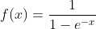
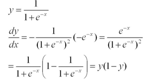
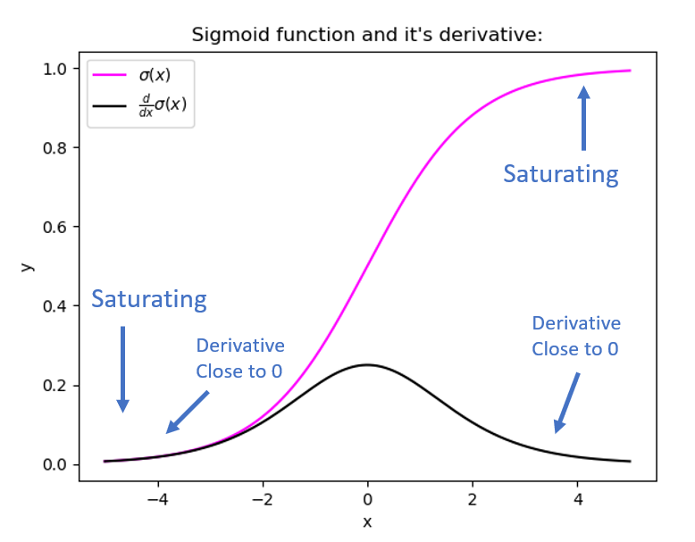

# My Notes 

## Regularization: 
Any modification done to reduce the variance in the model at the cost of bias is regularization.
i.e. L1 and L2 and the direct impact is, cost function is added with the magnitude of the weights so to penalize large value of it.
Other methods are:
- L1 and L2
- Dropout
- Early stopping

One thing common about Regularizer is the direct impact on the weights to reduce its complexity and making it dumber.

## Optimizer
Optimizer is the overall weight update strategy for the model. Optimizer in itself does not affect back-propagation calculations unlike the Regularizer but the actual update done in weight is affected by it.
1. **Stochastic Gradient Descent**: Most straightforward way to directly subtract the average derivative of all examples. 
2. **SGD with Momentum**: We take the exponential moving average of gradient descent and make the changes smoother over iterations.
3. **RMS Prop**: Root mean square prop, using a momentum term in division.
4. **ADAM**

---

## Regularization  
Regularization reduces overfitting by adding a penalty to the loss function to discourage overly complex models.  

### How It Works  
Regularization modifies the loss function as follows:  
- **L1 Regularization**:  
```math
Loss_{total} = Loss_{data} + \lambda \sum |w|
```

- **L2 Regularization**:  
```math
Loss_{total} = Loss_{data} + \lambda \sum w^2
```

### Methods  
1. **L1 and L2**: Penalize large weights to encourage sparsity (L1) or reduce complexity (L2).  
2. **Dropout**: Randomly disables neurons during training to prevent co-adaptation.  

**Key Insight**: Regularization directly constrains weights to reduce model complexity, making the model simpler and improving generalization.

---

## Optimizer  
Optimizers define the strategy for updating model weights to minimize the loss function.

### Types  
1. **Stochastic Gradient Descent (SGD)**:  
   Updates weights by subtracting the gradient of the loss function, averaged over all examples:  
```math
w_{t+1} = w_t - \eta \cdot \nabla_w Loss
```

2. **SGD with Momentum**:  
   Smoothens updates by incorporating an exponential moving average of gradients:  
```math
v_t = \beta v_{t-1} + (1 - \beta) \nabla_w Loss \
w_{t+1} = w_t - \eta v_t
```

3. **RMSProp (Root Mean Square Propagation)**:
The proposition is to change the learning rate (alpha) in proportion to the magnitude of the gradient, i.e., the learning rate will be faster (also exponentially smoothened) for a large gradient.  
Generally, we expect weights to be higher in the early stage, so the learning rate will be higher, and as the model gets trained, alpha reduces to a minimum, making training stable till the end and enabling it to reach the global minima.  
Scales the learning rate by the moving average of squared gradients:   
```math
w_{t+1} = w_t - \frac{\eta}{\sqrt{E[g^2]_t + \epsilon}} \cdot \nabla_w Loss
```

4. **Adam (Adaptive Moment Estimation)**:  
   Combines momentum and RMSProp for adaptive learning rates:  
```math
m_t = \beta_1 m_{t-1} + (1 - \beta_1) \nabla_w Loss
```
```math
v_t = \beta_2 v_{t-1} + (1 - \beta_2) (\nabla_w Loss)^2
```
```math
w_{t+1} = w_t - \frac{\eta \cdot m_t}{\sqrt{v_t} + \epsilon}
```

5. **Adagrad (Adaptive Gradient Algorithm)**  
Adagrad adjusts the learning rate for each parameter based on the cumulative sum of squared gradients:  
```math
w_{t+1} = w_t - \frac{\eta}{\sqrt{G_t + \epsilon}} \cdot g_t
```
- $`G_t = \sum_{i=1}^t g_i^2 `$: Cumulative squared gradients.  
- $`\eta`$: Initial learning rate.  
- $`\epsilon`$: Small constant to prevent division by zero.

This formatting will ensure that all mathematical expressions are properly enclosed in `math` blocks for consistent rendering.

  **Intuition**  
  1. Parameters with **frequent large gradients** get smaller updates (learning rate decreases).  
  2. Parameters with **infrequent small gradients** get larger updates (learning rate increases).  
  
  **Strengths**  
  - Works well for **sparse data** or features (e.g., natural language processing).  
  - Automatically adjusts learning rates based on gradient history.
  
  **Weaknesses**  
  - The **cumulative sum** of squared gradients causes the learning rate to shrink indefinitely, leading to premature convergence.

---

Both regularization and optimizers work together to ensure the model is efficient, robust, and generalizes well to unseen data.


### Vanishing / Exploding gradients

- The Vanishing / Exploding gradients occurs when your derivatives become very small or very big.
- To understand the problem, suppose that we have a deep neural network with number of layers L, and all the activation functions are **linear** and each `b = 0`
  - Then:   
    ```
    Y' = W[L]W[L-1].....W[2]W[1]X
    ```
  - Then, if we have 2 hidden units per layer and x1 = x2 = 1, we result in:

    ```
    if W[l] = [1.5   0] 
              [0   1.5] (l != L because of different dimensions in the output layer)
    Y' = W[L] [1.5  0]^(L-1) X = 1.5^L 	# which will be very large
              [0  1.5]
    ```
    ```
    if W[l] = [0.5  0]
              [0  0.5]
    Y' = W[L] [0.5  0]^(L-1) X = 0.5^L 	# which will be very small
              [0  0.5]
    ```
- The last example explains that the activations (and similarly derivatives) will be decreased/increased exponentially as a function of number of layers.
- So If W > I (Identity matrix) the activation and gradients will explode.
- And If W < I (Identity matrix) the activation and gradients will vanish.
- Recently Microsoft trained 152 layers (ResNet)! which is a really big number. With such a deep neural network, if your activations or gradients increase or decrease exponentially as a function of L, then these values could get really big or really small. And this makes training difficult, especially if your gradients are exponentially smaller than L, then gradient descent will take tiny little steps. It will take a long time for gradient descent to learn anything.
- There is a partial solution that doesn't completely solve this problem but it helps a lot - careful choice of how you initialize the weights (next video).


[Good article on this Neptune.ai](https://neptune.ai/blog/vanishing-and-exploding-gradients-debugging-monitoring-fixing)

Here are the excerpt  and intuition of it

Why vanishing or exploding gradients problem happens?
With this intuitive understanding of what vanishing/exploding gradients are, you must be wondering – why do gradients vanish or explode in the first place, i.e., why do these gradient values diminish or blow up in their travel back through the network?

Vanishing 
Simply put, the vanishing gradients issue occurs when we use the Sigmoid or Tanh activation functions in the hidden layer; these functions squish a large input space into a small space. Take the Sigmoid as an example, we have the following p.d.f.:

Vanishing
Taking the derivative w.r.t. the parameter x, we get:


Vanishing
and if we visualize the Sigmoid function and its derivative:

Sigmoid function and it's derivative
Sigmoid function and its derivative | Source: Author 
We can see that the Sigmoid function squeezes our input space into a range between [0,1], and when the inputs become fairly small or fairly large, this function saturates at 0 or 1. These regions are referred to as ‘saturating regions’, whose derivatives become extremely close to zero. The same applies to the Tanh function that saturates at -1 and 1.

Suppose that we have inputs that lie in any of the saturating regions, we would essentially have no gradient values to propagate back, leading to a zero update in earlier layer weights. Usually, this is no big of a concern for shallow networks with just a couple of layers, however, when we add more layers, vanishing gradients in initial layers will result in model training or convergence failure. 

This is due to the effect of multiplying n of these small numbers to compute gradients of the early layers in an n-layer network, meaning that the gradient decreases exponentially with n while the early layers train very slowly and thus the performance of the entire network degrades. 

Exploding 
Moving on to the exploding gradients, in a nutshell, this problem is due to the initial weights assigned to the neural nets creating large losses. Big gradient values can accumulate to the point where large parameter updates are observed, causing gradient descents to oscillate without coming to global minima. 

What’s even worse is that these parameters can be so large that they overflow and return NaN values that cannot be updated anymore. 


My Notes:

Intuition is because sigmoid and tanh has a very large range of x for which its value is same (i.e. derivative ==0) except for (-1,1), it is more than likely that its value is very close to zero.
Due to which deep layer in the back which gets multiple of all ahead layers activation function gradient tend towards zero. 
To overcome this Relu (LeakyRelu) is used, it is on another extreme with same gradient ==1 for all x and ==0 for x <0, so it handles the leaky problem well.

But the original argument of using the activation function was to introduce non-linearity in the model, which we have kind of get rid off. The thing is the sharp kink in Relu is enough to introduce non-linearity in
deep neural networks.


For exploding gradient, problem lies mostly in initiation when weights get too high value.


# Notes about L1 and L2 regularization 

Derivative of L1 weight term is fixed while for L2 it has the same weight magnitude so L2 punishes W according to its weight while L1 punish them all equally.
hence we expect L1 to be more sparsed i.e. lots of terms in the weight matrix to be zero.