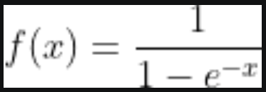

# My Notes 

## Regularization: 
Any modification done to reduce the variance in the model at the cost of bias is regularization.
i.e. L1 and L2 and the direct impact is, cost function is added with the magnitude of the weights so to penalize large value of it.
Other methods are:
- L1 and L2
- Dropout
- Early stopping

One thing common about Regularizer is the direct impact on the weights to reduce its complexity and making it dumber.

## Optimizer
Optimizer is the overall weight update strategy for the model. Optimizer in itself does not affect back-propagation calculations unlike the Regularizer but the actual update done in weight is affected by it.
1. **Stochastic Gradient Descent**: Most straightforward way to directly subtract the average derivative of all examples. 
2. **SGD with Momentum**: We take the exponential moving average of gradient descent and make the changes smoother over iterations.
3. **RMS Prop**: Root mean square prop, using a momentum term in division.
4. **ADAM**

---

## Regularization  
Regularization reduces overfitting by adding a penalty to the loss function to discourage overly complex models.  

### How It Works  
Regularization modifies the loss function as follows:  
- **L1 Regularization**:  
```math
Loss_{total} = Loss_{data} + \lambda \sum |w|
```
- **L2 Regularization**:  
```math
Loss_{total} = Loss_{data} + \lambda \sum w^2
```

### Methods  
1. **L1 and L2**: Penalize large weights to encourage sparsity (L1) or reduce complexity (L2).  
2. **Dropout**: Randomly disables neurons during training to prevent co-adaptation.  

**Key Insight**: Regularization directly constrains weights to reduce model complexity, making the model simpler and improving generalization.

---

## Optimizer  
Optimizers define the strategy for updating model weights to minimize the loss function.

### Types  
1. **Stochastic Gradient Descent (SGD)**:  
   Updates weights by subtracting the gradient of the loss function, averaged over all examples:  
```math
w_{t+1} = w_t - \eta \cdot \nabla_w Loss
```

2. **SGD with Momentum**:  
   Smoothens updates by incorporating an exponential moving average of gradients:  
```math
v_t = \beta v_{t-1} + (1 - \beta) \nabla_w Loss
``` 
```math
w_{t+1} = w_t - \eta v_t
```

3. **RMSProp (Root Mean Square Propagation)**:
- This is about Adapting learning rate as per the magnitude of that weight. The proposition is to change the learning rate (alpha) in proportion to the magnitude of the gradient, i.e., the learning rate will be faster (also exponentially smoothened) for a large gradient.  
- - Generally, we expect weights to be higher in the early stage, so the learning rate will be higher, and as the model gets trained, alpha reduces to a minimum, making training stable till the end and enabling it to reach the global minima. From experimentation, we Know that dB is much larger than dW, and we need to control model moment in vertical direction but still keep its momentum in horizontal direction
- RMSprop allows us to do exactly, it dampens the model movement in vertical direction and keep moving in horizontal direction
- Please Note: the aim of this is widely different then of the ADAgrad which keep dampening the model movement as it progress the iteration no matter what.
- Scales the learning rate by the moving average of squared gradients:   
```math
w_{t+1} = w_t - \frac{\eta}{\sqrt{E[g^2]_t + \epsilon}} \cdot \nabla_w Loss
```


4. **Adam (Adaptive Moment Estimation)**:  
   Combines momentum and RMSProp for adaptive learning rates:  
```math
m_t = \beta_1 m_{t-1} + (1 - \beta_1) \nabla_w Loss
```
  

```math
v_t = \beta_2 v_{t-1} + (1 - \beta_2) (\nabla_w Loss)^2
```
  

```math
w_{t+1} = w_t - \frac{\eta \cdot m_t}{\sqrt{v_t} + \epsilon}
```
  

5. **Adagrad (Adaptive Gradient Algorithm)**  

This is widely different from above-mentioned which are kind of better of one another this one is on a tangent and has a completely different ai m of reducing the learning rate as the training progress.
Adagrad adjusts the learning rate for each parameter based on the cumulative sum of squared gradients:  
```math
w_{t+1} = w_t - \frac{\eta}{\sqrt{G_t + \epsilon}} \cdot g_t
```
- $`G_t = \sum_{i=1}^t g_i^2 `$: Cumulative squared gradients.  
- $`\eta`$: Initial learning rate.  
- $`\epsilon`$: Small constant to prevent division by zero.

This formatting will ensure that all mathematical expressions are properly enclosed in `math` blocks for consistent rendering.

  **Intuition**  
  1. Parameters with **frequent large gradients** get smaller updates (learning rate decreases).  
  2. Parameters with **infrequent small gradients** get larger updates (learning rate increases).  
  
  **Strengths**  
  - Works well for **sparse data** or features (e.g., natural language processing).  
  - Automatically adjusts learning rates based on gradient history.
  
  **Weaknesses**  
  - The **cumulative sum** of squared gradients causes the learning rate to shrink indefinitely, leading to premature convergence.

---


Both regularization and optimizers work together to ensure the model is efficient, robust, and generalizes well to unseen data.


### Vanishing / Exploding gradients

- The Vanishing / Exploding gradients occurs when your derivatives become very small or very big.
- To understand the problem, suppose that we have a deep neural network with number of layers L, and all the activation functions are **linear** and each `b = 0`
  - Then:   
    ```
    Y' = W[L]W[L-1].....W[2]W[1]X
    ```
  - Then, if we have 2 hidden units per layer and x1 = x2 = 1, we result in:

    ```
    if W[l] = [1.5   0] 
              [0   1.5] (l != L because of different dimensions in the output layer)
    Y' = W[L] [1.5  0]^(L-1) X = 1.5^L 	# which will be very large
              [0  1.5]
    ```
    ```
    if W[l] = [0.5  0]
              [0  0.5]
    Y' = W[L] [0.5  0]^(L-1) X = 0.5^L 	# which will be very small
              [0  0.5]
    ```
- The last example explains that the activations (and similarly derivatives) will be decreased/increased exponentially as a function of number of layers.
- So If W > I (Identity matrix) the activation and gradients will explode.
- And If W < I (Identity matrix) the activation and gradients will vanish.
- Recently Microsoft trained 152 layers (ResNet)! which is a really big number. With such a deep neural network, if your activations or gradients increase or decrease exponentially as a function of L, then these values could get really big or really small. And this makes training difficult, especially if your gradients are exponentially smaller than L, then gradient descent will take tiny little steps. It will take a long time for gradient descent to learn anything.
- There is a partial solution that doesn't completely solve this problem but it helps a lot - careful choice of how you initialize the weights (next video).


Here is the reformatted markdown for improved readability and organization:

# Vanishing and Exploding Gradients

[Good article on this Neptune.ai](https://neptune.ai/blog/vanishing-and-exploding-gradients-debugging-monitoring-fixing)

## Excerpt and Intuition

### Why does the vanishing or exploding gradient problem happen?

With this intuitive understanding of what vanishing/exploding gradients are, you must be wondering:  
Why do gradients vanish or explode in the first place, i.e., why do these gradient values diminish or blow up in their travel back through the network?

---

### **Vanishing Gradients**

The vanishing gradient issue occurs when using the **Sigmoid** or **Tanh** activation functions in the hidden layers. These functions squish a large input space into a small space.  

#### Example: Sigmoid Function
The Sigmoid has the following p.d.f.:


Taking the derivative with respect to the parameter \( x \), we get:


If we visualize the Sigmoid function and its derivative:


**Key Observation**:  
- The Sigmoid function squeezes the input space into a range between \([0, 1]\).  
- For inputs that are very small or very large, the function saturates at 0 or 1, referred to as the **saturating regions**.  
- In these regions, the derivatives become extremely close to zero.

The same behavior applies to the Tanh function, which saturates at -1 and 1.

#### Problem with Saturating Regions
- If the inputs lie in the saturating regions, gradients effectively vanish, leading to no weight updates for earlier layers.  
- This issue becomes more prominent in deep networks, where the gradients of initial layers diminish exponentially with the number of layers \( n \), causing the training to fail or converge extremely slowly.

---

### **Exploding Gradients**

The exploding gradient problem arises due to large initial weights assigned to the neural network.  

#### Key Points:
- Large gradient values accumulate, resulting in large parameter updates.  
- This leads to oscillations in gradient descent, preventing convergence to the global minima.  
- In extreme cases, the parameters can overflow, resulting in NaN values that halt training.

---

## **My Notes**

### Vanishing Gradients:
- **Cause**: Sigmoid and Tanh have very small derivatives (close to zero) outside the range \((-1, 1)\).  
- **Impact**: Gradients for deep layers multiply through the chain, eventually tending towards zero.  
- **Solution**:  
  - Use **ReLU** (or Leaky ReLU) activation functions.  
  - ReLU gradients are 1 for \( x > 0 \) and 0 for \( x \leq 0 \), effectively avoiding the vanishing gradient issue.  

**Trade-off**:  
While ReLU introduces sharp kinks for non-linearity, it may reduce the non-linearity in the model compared to Sigmoid/Tanh. However, the sharp kinks are sufficient for deep neural networks.

### Exploding Gradients:
- **Cause**: Improper initialization where weights are assigned excessively large values.  
- **Impact**: Gradients grow uncontrollably, causing instability in training.

---

# Notes about L1 and L2 Regularization

### Derivatives:
- **L1 Regularization**: The derivative of the weight term is fixed, applying an equal penalty to all weights.  
- **L2 Regularization**: The derivative is proportional to the weight magnitude, penalizing larger weights more heavily.

### Impact:
- **L1 Regularization**: Encourages sparsity in the weight matrix, resulting in many weights being exactly zero.  
- **L2 Regularization**: Reduces the magnitude of weights but does not necessarily lead to sparsity.
