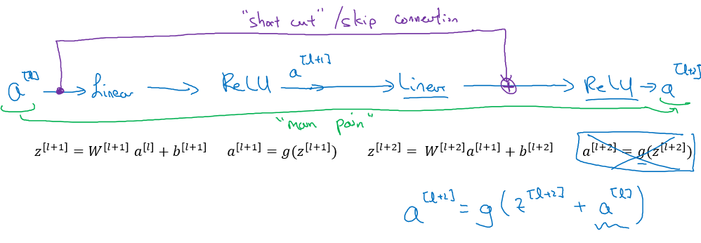

## What is Resnet?
### Residual Networks (ResNets)

- Very, very deep NNs are difficult to train because of vanishing and exploding gradients problems.
- In this section we will learn about skip connection which makes you take the activation from one layer and suddenly feed it to another layer even much deeper in NN which allows you to train large NNs even with layers greater than 100.
- **Residual block**
  - ResNets are built out of some Residual blocks.
  - 
  - They add a shortcut/skip connection before the second activation.
  - The authors of this block find that you can train a deeper NNs using stacking this block.
  - [[He et al., 2015. Deep residual networks for image recognition]](https://arxiv.org/abs/1512.03385)
- **Residual Network**
  - Are a NN that consists of some Residual blocks.
  - 
  - These networks can go deeper without hurting the performance. In the normal NN - Plain networks - the theory tell us that if we go deeper we will get a better solution to our problem, but because of the vanishing and exploding gradients problems the performance of the network suffers as it goes deeper. Thanks to Residual Network we can go deeper as we want now.
  - 
  - On the left is the normal NN and on the right are the ResNet. As you can see the performance of ResNet increases as the network goes deeper.
  - In some cases going deeper won't effect the performance and that depends on the problem on your hand.
  - Some people are trying to train 1000 layer now which isn't used in practice. 
  - [He et al., 2015. Deep residual networks for image recognition]
- Residual blocks types:

  - Identity block:
    - 
    - Hint the conv is followed by a batch norm `BN` before `RELU`. Dimensions here are same.
    - This skip is over 2 layers. The skip connection can jump n connections where n>2
    - This drawing represents [Keras](https://keras.io/) layers.
  - The convolutional block:
    - 
    - The conv can be bottleneck 1 x 1 conv

### Network in Network and 1 X 1 convolutions

- A 1 x 1 convolution  - We also call it Network in Network- is so useful in many CNN models.

- What does a 1 X 1 convolution do? Isn't it just multiplying by a number?

  - Lets first consider an example:
    - Input: `6x6x1`
    - Conv: `1x1x1` one filter.        `# The 1 x 1 Conv`
    - Output: `6x6x1`
  - Another example:
    - Input: `6x6x32`
    - Conv: `1x1x32` 5 filters.     `# The 1 x 1 Conv`
    - Output: `6x6x5`

- The Network in Network is proposed in [Lin et al., 2013. Network in network]

- It has been used in a lot of modern CNN implementations like ResNet and Inception models.

- A 1 x 1 convolution is useful when:

  - We want to shrink the number of channels. We also call this feature transformation.
    - In the second discussed example above we have shrinked the input from 32 to 5 channels.
  - We will later see that by shrinking it we can save a lot of computations.
  - If we have specified the number of 1 x 1 Conv filters to be the same as the input number of channels then the output will contain the same number of channels. Then the 1 x 1 Conv will act like a non linearity and will learn non linearity operator. 

- Replace fully connected layers with 1 x 1 convolutions as Yann LeCun believes they are the same.

  - > In Convolutional Nets, there is no such thing as "fully-connected layers". There are only convolution layers with 1x1 convolution kernels and a full connection table. [Yann LeCun](https://www.facebook.com/yann.lecun/posts/10152820758292143) 

- [[Lin et al., 2013. Network in network]](https://arxiv.org/abs/1312.4400)

---
---

The mathematical intuition behind how a **ResNet (Residual Network)** handles the **vanishing gradient problem** lies in its use of **skip (residual) connections**. These connections allow gradients to flow directly through the network, bypassing layers, and thus mitigate the vanishing gradient problem. Here's a detailed breakdown:

---

### 1. **Vanishing Gradient Problem Recap**
The **vanishing gradient problem** occurs when gradients of the loss function w.r.t. earlier layers shrink exponentially during backpropagation. This typically happens in deep neural networks due to repeated application of small derivatives (from activation functions like sigmoid or tanh).

Mathematically:
```math
\frac{\partial L}{\partial w} = \frac{\partial L}{\partial z_n} \cdot \frac{\partial z_n}{\partial z_{n-1}} \cdot \dots \cdot \frac{\partial z_1}{\partial w}

```
If $`\frac{\partial z_i}{\partial z_{i-1}} < 1`$, the gradients diminish as they propagate backward through many layers.

---

### 2. **Skip Connections in ResNet**
In a **ResNet**, instead of learning a direct mapping $`H(x)`$ (desired output of a layer), each block learns a **residual mapping** $`F(x) = H(x) - x`$. The output of a residual block is then:
```math
y = F(x) + x
```

where:
- $`F(x)`$: residual mapping (learned by the block).
- $`x`$: input to the block (passed unchanged via the skip connection).

---

### 3. **Gradient Flow Through Skip Connections**
During backpropagation, the skip connections allow gradients to bypass the nonlinear transformations $`F(x)`$. Mathematically, consider the gradient of the loss $`L`$ w.r.t. the input $`x`$ of a block:
```math
\frac{\partial L}{\partial x} = \frac{\partial L}{\partial y} \cdot \left(\frac{\partial y}{\partial x}\right)
```
For the residual block:
```math
y = F(x) + x \implies \frac{\partial y}{\partial x} = \frac{\partial F(x)}{\partial x} + 1
```
Thus:
```math
\frac{\partial L}{\partial x} = \frac{\partial L}{\partial y} \cdot \left(\frac{\partial F(x)}{\partial x} + 1\right)
```
The key term here is the **"1"** from the skip connection. It ensures that the gradient $`\frac{\partial L}{\partial x}`$ does not vanish, even if $`F(x) = H(x) - x`$ becomes very small.

---

### 4. **ResNet Enables Efficient Learning**
- **Shortcut Pathways**: Even if the residual mapping $`F(x)`$ is poorly learned or has vanishing gradients, the identity mapping $`x \rightarrow y = x`$ is always preserved. This ensures gradients flow efficiently through the network.
- **Deeper Architectures**: By reducing the risk of vanishing gradients, ResNets enable very deep networks (e.g., 100+ layers) to train effectively.

---

### 5. **Empirical and Theoretical Insight**
ResNet's success can also be viewed from the perspective of:
- **Identity Mapping as Initialization**: If $`F(x) = 0`$, the block outputs $`y = x`$ . This makes the initial network resemble a shallow identity network, which is easier to optimize.
- **Easier Optimization**: By focusing on learning residuals rather than the entire mapping $`H(x)`$ , optimization becomes simpler.

---

### Summary
ResNets handle the vanishing gradient problem through **skip connections**, which introduce identity mappings. These connections allow gradients to flow backward directly, ensuring they do not vanish, regardless of the depth of the network. The gradient flow is mathematically preserved by the additive term $`1`$ in the derivative of the residual block's output.


