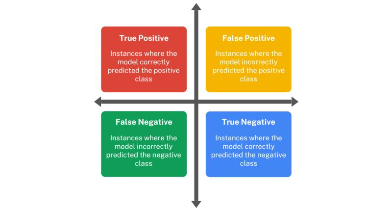

# Correct order - My intuition is set on this

### **Confusion Matrix:**

A simple binary classification confusion matrix looks like this:

|                 | Predicted Positive | Predicted Negative |
|-----------------|--------------------|--------------------|
| **Actual Positive** | True Positive (TP)      | False Negative (FN)      |
| **Actual Negative** | False Positive (FP)     | True Negative (TN)       |

---



Sure! Here's a breakdown of the metrics and their definitions in terms of True Positives (TP), False Positives (FP), True Negatives (TN), and False Negatives (FN):

---

### **Definitions:**

1. **Precision (Positive Predictive Value)**:  
   
   ```math
   \text{Precision} = \frac{TP}{TP + FP}
    ```  
   - Measures the proportion of positive predictions that are actually correct.

2. **Recall (True Positive Rate, Sensitivity):**  
   ```math  
   \text{Recall} = \frac{TP}{TP + FN}
   ```  
   - Measures the proportion of actual positives that are correctly identified.

3. **True Positive Rate (TPR):**  
   ```math 
    TPR = \frac{TP}{TP + FN}
   ```  
   - Synonym for Recall or Sensitivity.

4. **False Positive Rate (FPR):**  
   ```math
   FPR = \frac{FP}{FP + TN}
   ```
   - Measures the proportion of negatives incorrectly classified as positives.

5. **Specificity (True Negative Rate):**  
   ```math
   \text{Specificity} = \frac{TN}{TN + FP}
   ```
   - Measures the proportion of actual negatives correctly classified.

6. **Accuracy:**  
   ```math 
   \text{Accuracy} = \frac{TP + TN}{TP + TN + FP + FN}
   ```  
   - Measures the overall correctness of predictions.

7. **F1-Score:**  
   ```math
   F1 = 2 \cdot \frac{\text{Precision} \cdot \text{Recall}}{\text{Precision} + \text{Recall}}
   ```  
   - Harmonic mean of Precision and Recall.

8. **Balanced Accuracy:**  
   ```math 
    \text{Balanced Accuracy} = \frac{\text{TPR} + \text{Specificity}}{2}
   
    ```

---


Let me know if you’d like to calculate these metrics for a specific example!
