## First Notes

Understand what is Decision Tree and Random Forest rest is just very simple.

[Read from here](https://www.analyticsvidhya.com/blog/2016/04/tree-based-algorithms-complete-tutorial-scratch-in-python/)

Succession is as follows
1. Decision Tree
2. Random Forest
2. AdaBoost
2. Gradient Boosting
3. XGBoost

# Other Usage to Understand (Refer Later in this guide)
1. Feature Extraction using GBDT
2. Feature Reduction using GBDT (Feature Importance/ selection)
3. Data Imputation using GBDT (missing value imputation)

The Basic idea Behind Random Forest is the feature which is at the top of the tree is the most important feature. The more the feature is at the top of the tree the more important it is. Moreover it calculates the Information gain by using some particular formula. The more the information gain the more important the feature is.


# Decision Tree Matrices

Sure! Here's your content rewritten in **Markdown** format with improved structure, readability, and clear visual explanations to help build deep intuition around **Decision Tree splitting criteria**.

---

# 🌳 Decision Tree Splitting Criteria – Core Concepts

The algorithm selection for decision trees largely depends on the **type of target variable** (categorical vs. continuous). Below are the **four most commonly used algorithms** to determine the best feature split:

---

## 🔹 1. **Gini Index**

> _"Probability of randomly chosen elements being of the same class."_

- **Used for**: Classification (categorical target)
- **Splits**: Binary only (used in **CART** – Classification and Regression Trees)
- **Interpretation**: Lower Gini → better purity (homogeneity)

### 🔧 How to Calculate Gini:
1. For each sub-node:  
   ```math  Gini = p^2 + q^2 ```math   
   where `p` = probability of success, `q` = probability of failure.
2. For the split:  
   ```math  Gini_{split} = \sum_{i} \left(\frac{n_i}{N} \cdot Gini_i\right) ```  

---

### 📊 Example: Splitting on "Gender" and "Class"

| Split | Node | Success | Failure | Gini Node | Weight | Weighted Gini |
|-------|------|---------|---------|-----------|--------|----------------|
| Gender | Female | 2 | 8 | 0.68 | 10/30 | 0.227 |
|        | Male   | 13 | 7 | 0.55 | 20/30 | 0.366 |
|        |        |     |   |       |        | **0.59** |
| Class | IX     | 6 | 8 | 0.51 | 14/30 | 0.238 |
|       | X      | 9 | 7 | 0.51 | 16/30 | 0.272 |
|       |        |     |   |       |        | **0.51** |

✅ **Gender** split is better since **0.59 > 0.51**

> **Gini Impurity** = 1 − Gini

---

## 🔹 2. **Chi-Square**

> _"Statistical significance between observed and expected frequencies."_

- **Used for**: Classification (categorical target)
- **Splits**: Binary or multi-way (used in **CHAID**)
- **Interpretation**: Higher Chi-square → more significant split

### 🔧 How to Calculate Chi-Square:
1. For each class:  
   ```math  \chi^2 = \frac{(Actual - Expected)^2}{Expected} ```  
2. Sum the Chi-square scores of all classes and nodes.

---

### 📊 Example (Split on Gender):

| Node | Actual (Play, Not Play) | Expected (Play, Not Play) | Deviation | Chi-Square |
|------|--------------------------|----------------------------|-----------|------------|
| Female | 2, 8 | 5, 5 | -3, +3 | 3.6 |
| Male | 13, 7 | 10, 10 | +3, -3 | 1.8 |
| **Total** | | | | **5.4** |

✅ Gender again is more significant than Class for splitting.

---

## 🔹 3. **Information Gain (Entropy Based)**

> _"How much information is reduced after the split."_  
> Used by: **ID3**, **C4.5**

- **Used for**: Classification (categorical target)
- **Entropy** measures disorder:  
  ```math  Entropy = -p \log_2(p) - q \log_2(q) ```  
- **Information Gain** = Entropy(Parent) − Weighted Entropy(Children)

---

### 📊 Example: Entropy Calculations

| Node      | Success | Failure | Entropy |
|-----------|---------|---------|---------|
| Parent    | 15 | 15 | 1.0     |
| Female    | 2 | 8  | 0.72    |
| Male      | 13 | 7 | 0.93    |

> Weighted Entropy (Gender split) =  
> ```math  \frac{10}{30} \cdot 0.72 + \frac{20}{30} \cdot 0.93 = 0.86 ```math   
>  
> Information Gain = 1.0 − 0.86 = **0.14**

| Node      | IX | X | Entropy |
|-----------|----|---|---------|
| Class IX  | 6 | 8 | 0.99     |
| Class X   | 9 | 7 | 0.99     |
> Weighted Entropy = **0.99** → IG = 1.0 − 0.99 = **0.01**

✅ **Split on Gender** gives higher **information gain**

---

## 🔹 4. **Reduction in Variance (for Regression)**

> _"Split that reduces output variance the most."_  
> Used in: **Regression Trees**

- **Used for**: Continuous target variable
- **Variance** =  
  ```math  \frac{1}{n} \sum (x_i - \bar{x})^2 ```  

---

### 📊 Example:

Assign `1` for "Play", `0` for "Not Play".

- Parent Mean = 0.5  
  ```math  \text{Var}_{root} = 0.25 ```  

| Node   | Mean | Variance |
|--------|------|----------|
| Female | 0.2  | 0.16     |
| Male   | 0.65 | 0.23     |

> Weighted Variance (Gender) =  
> ```math  \frac{10}{30} \cdot 0.16 + \frac{20}{30} \cdot 0.23 = 0.21 ```  

| Node   | Mean | Variance |
|--------|------|----------|
| Class IX | 0.43 | 0.24 |
| Class X  | 0.56 | 0.25 |

> Weighted Variance (Class) = **0.25**

✅ Gender gives lower variance → better split

---

# 🎯 Summary

| Criterion | Type of Target | Algorithm | Splitting Style | Best When |
|-----------|----------------|-----------|------------------|-----------|
| **Gini** | Categorical | CART | Binary | Fast + Pure |
| **Chi-Square** | Categorical | CHAID | Multi-way | Stat significance |
| **Info Gain (Entropy)** | Categorical | ID3, C4.5 | Binary | Info-theoretic split |
| **Variance Reduction** | Continuous | CART | Binary | Regression tasks |

---

> ✅ Choose the splitting criterion **based on the target type and interpretability**.  
> For classification: Gini and Info Gain dominate.  
> For regression: Variance reduction is ideal.

---


## AdaBoost 

[StatQuest Video](https://www.youtube.com/watch?v=LsK-xG1cLYA&ab_channel=StatQuestwithJoshStarmer)

AdaBoost is a **Boosting** algorithm that combines multiple weak classifiers to create a strong classifier. It focuses on correcting the errors made by previous classifiers, making it effective for various classification tasks.
- **Weak Learner**: A model that performs slightly better than random guessing.
Stump : A decision tree with only one split (1 node + 2 leaves).
- In this the next stump will be seeing data that is oversampled from the example where first stump made a mistake.
- This is done using the formula given below. But that is it. increase number of sample of the misclassified data and decrease the %number of sample of the correctly classified data.

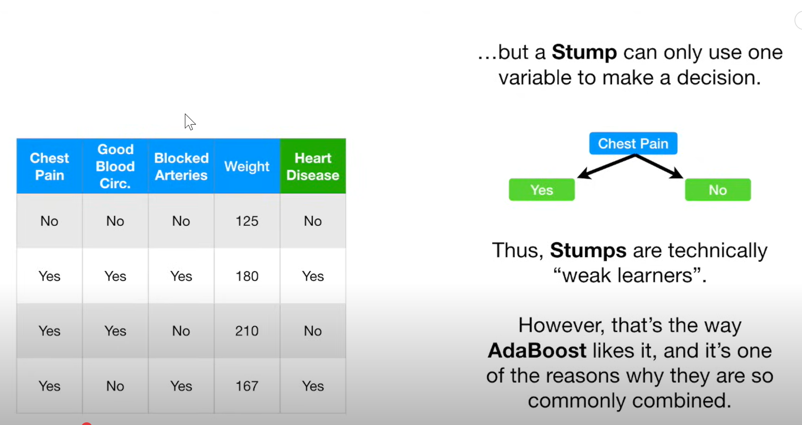

Three main ideas behind AdaBoost:
1. **Sequential Learning**: Each weak learner is trained on the errors of the previous one.
2. **Weighted Voting**: Each weak learner's vote is weighted based on its accuracy.
3. **Focus on Hard Examples**: More weight is given to misclassified samples, making the model focus on harder-to-classify instances.
4. **Final Prediction**: The final prediction is made by combining the weighted votes of all weak learners.
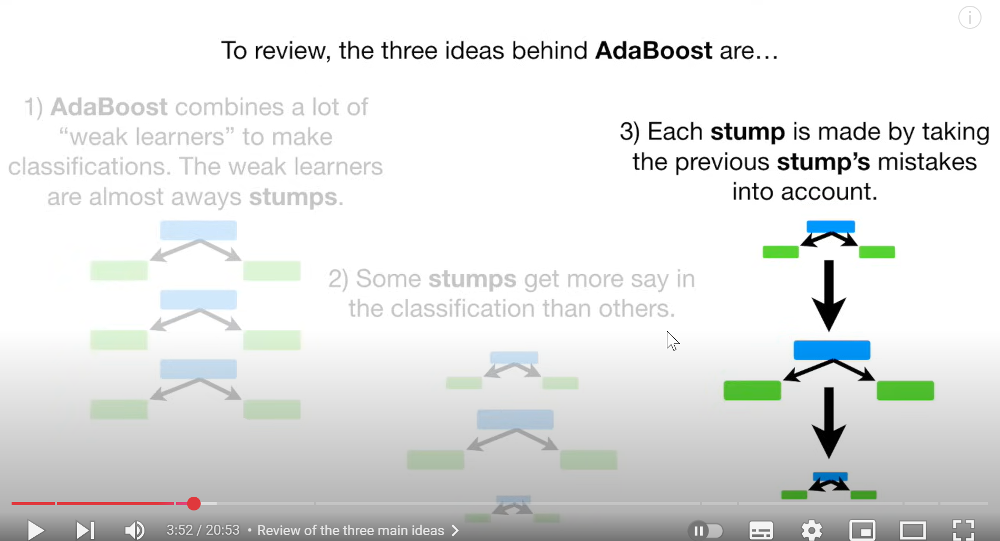

Mathematics and other intution and as given below
---

## **📌 Introduction**
- AdaBoost is mostly used with **decision stumps (1 node + 2 leaves)**.
- Compared with **Random Forests** to highlight key differences.

---

## **🌳 Random Forest vs. AdaBoost**

| Concept                        | Random Forest                       | AdaBoost                              |
|-------------------------------|--------------------------------------|----------------------------------------|
| Learner Type                  | Full Decision Trees                 | Weak Learners (Stumps)                |
| Voting Power                  | Equal for all trees                 | Weighted voting based on accuracy     |
| Independence of Trees         | Trees are built independently       | Trees are built sequentially          |
| Learning Influence            | No influence from other trees       | Each stump is influenced by prior errors |

---

## **📘 Key Concepts of AdaBoost**

1. Combines many **weak learners** (usually stumps).
2. Some stumps get **more say** based on performance.
3. Each stump is **built sequentially**, correcting the errors of the previous ones.

---

## **🧱 Building AdaBoost – Step-by-Step**

### **1. Initialize Sample Weights**

- Start with **equal weight** for each sample:
  ```math
  w_i = \frac{1}{N}
  ```

### **2. Train First Stump**
- Try splitting on each feature.
- Use **Gini Index** to find the best split.
- Choose feature with lowest Gini (best separation).

---

### 📊 **Example Gini Calculation Table**

| Feature        | Gini Index | Error Count | Error Rate |
|----------------|------------|-------------|------------|
| Chest Pain     | X1         | 3           | 3/8        |
| Blocked Artery | X2         | ?           | ?          |
| Weight         | **Lowest** | 1           | 1/8        |

✅ **Choose "Weight" for the first stump**

---

### **3. Calculate Amount of Say**
Formula:
```math
\text{Say} = \frac{1}{2} \cdot \log\left(\frac{1 - \text{Error}}{\text{Error}}\right)
```

📈 **Intuition:**

- Low error → High positive say → Trusted vote
- Error = 0.5 → Say = 0 (random guess)
- High error → Negative say → Vote flips

---

### **Example: Say Calculation**

For `error = 1/8`:

```math
\text{Say} = \frac{1}{2} \cdot \log\left(\frac{7/8}{1/8}\right) ≈ 0.97
```

---

## **♻️ Updating Sample Weights**

### **Incorrectly Classified:**
```math
w_i \leftarrow w_i \cdot e^{\text{Say}}
```

### **Correctly Classified:**
```math
w_i \leftarrow w_i \cdot e^{-\text{Say}}
```
$w_i \leftarrow w_i \cdot e^{-\text{Say}}$

🧮 Normalize all weights to sum to 1.

---

## **📦 Two Options for Next Iteration**

1. **Weighted Gini** for next stump.
2. **Resample Dataset** based on weights (bootstrap sampling).

📌 Samples misclassified earlier get **duplicated more** → More influence.

---

### 🎲 Sampling Example:

If sample A has weight = 0.33  
→ It might appear **4 times** in new data of same size.

---

## **🗳️ Final Classification – How AdaBoost Predicts**

1. Each stump votes based on its decision.
2. Votes are **weighted by Say** value.
3. Total sum of "say" values for each class.
4. Class with higher sum wins.

🧠 **Think of it like:**
```text
HAS_DISEASE: stump1 (0.97) + stump3 (0.42) = 1.39  
NO_DISEASE : stump2 (0.33) + stump4 (0.29) = 0.62  
→ Predict: HAS_DISEASE
```


---

## Gradient Boosting
[StatQuest Video - only one is enough](https://www.youtube.com/watch?v=3CC4N4z3GJc&list=PLblh5JKOoLUJjeXUvUE0maghNuY2_5fY6&index=1&ab_channel=StatQuestwithJoshStarmer)

Sure! Here's a cleaner, more readable version of your explanation using Markdown, with enhanced language and structure while preserving the image references:

---

## 🌲 Step-by-Step Intuition Behind Gradient Boosting

We’ll walk through the **Gradient Boosting** process using a simple example to build deep intuition. Visuals will help explain each concept clearly.

---

### 🔹 Initial Step: Start with a Baseline Prediction

We begin by predicting the **average of the output values**. This serves as the initial model.

> 📌 This is the prediction from the **zeroth** tree.  
> 🔁 Next, we compute the **residuals** (i.e., the difference between actual values and the predicted average).

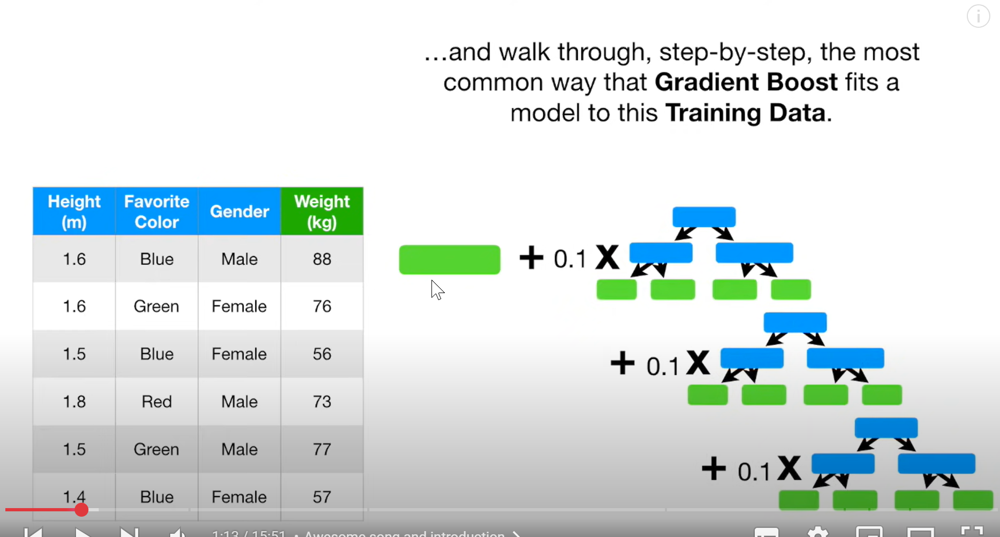

---

### 🔹 Tree Structure Differences: AdaBoost vs Gradient Boosting

In **AdaBoost**, each tree is a decision stump (i.e., has only 2 leaf nodes).  
But in **Gradient Boosting**, trees can have **more than 2 leaves**, though the number of leaves is typically fixed.

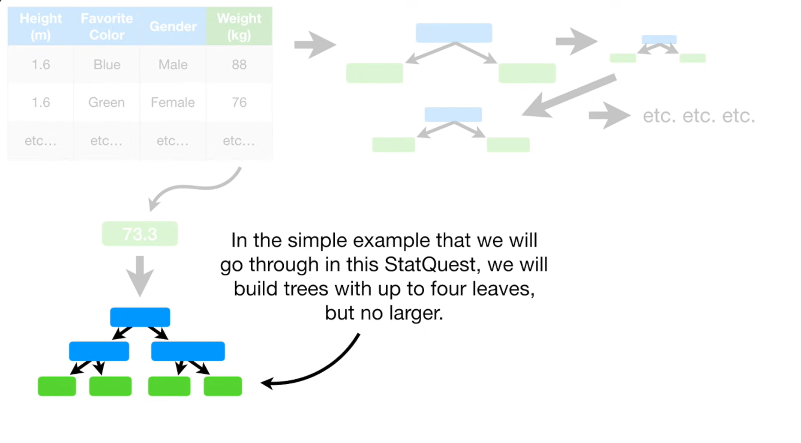

---

### 🧮 Step 0: Compute Residuals

Using the baseline prediction, we calculate the residuals for each data point. These residuals represent what’s left for the next tree to learn.

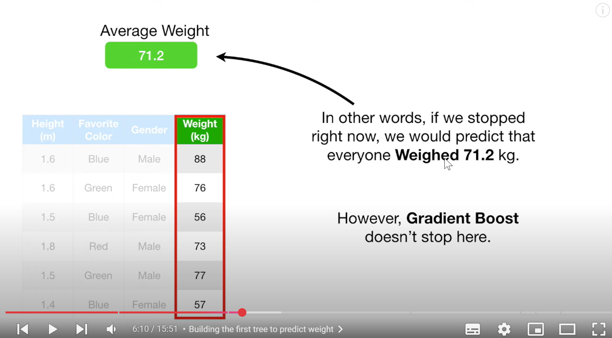

---

### 🌳 Step 1: Fit a Tree to the Residuals

Now, we fit a new decision tree to these residuals. This tree tries to predict the errors made by the previous model.

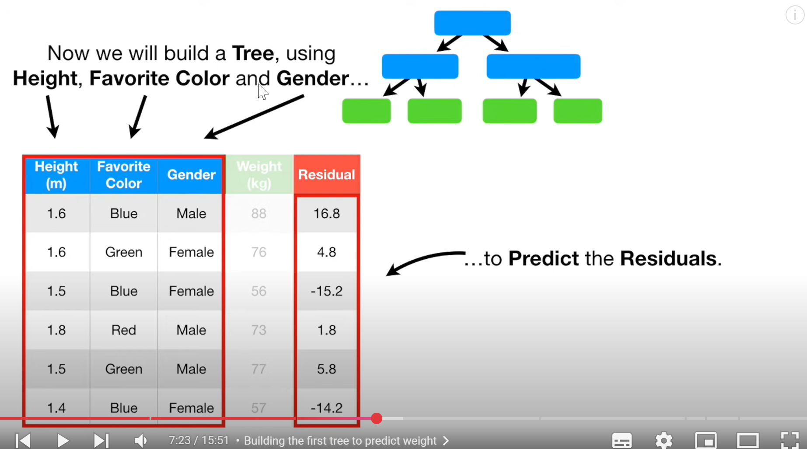

---

### 🍂 Step 2: Restrict Leaf Nodes and Average Predictions

We restrict the number of leaf nodes to `m` (e.g., 4), where `m < M`.  
Since multiple data points may fall into a single leaf, we **average their residuals** in each leaf to get the leaf output.

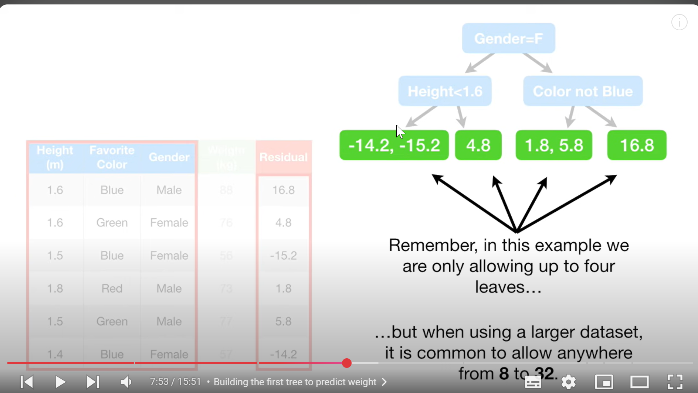  
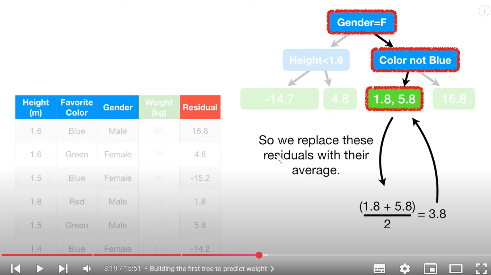

---

### ➕ Step 3: Update Predictions

We update our original predictions by adding the output of this residual tree.  
However, to avoid overfitting, we **scale this update** by a factor called the **learning rate** (typically 0.1).

```math
\text{New Prediction} = \text{Old Prediction} + 0.1 \times \text{Residual Tree Output}
```

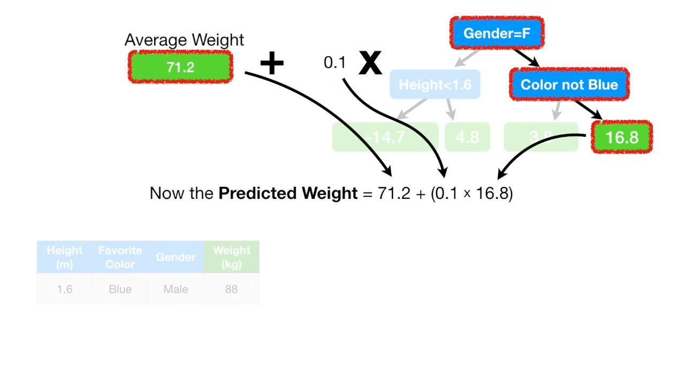  
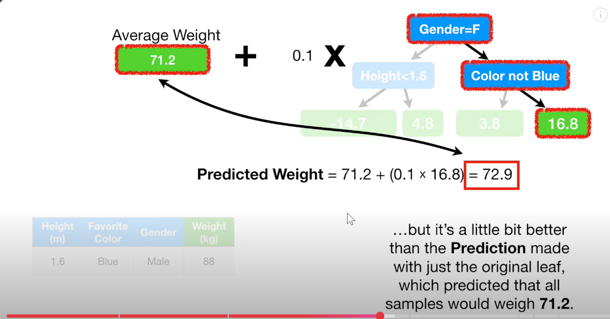

---

### 🔁 Repeat the Process

We continue this process iteratively:
- Compute residuals
- Fit a tree to the residuals
- Update the predictions with a scaled version of the new tree’s output

Repeat for **N trees** to build a strong ensemble!

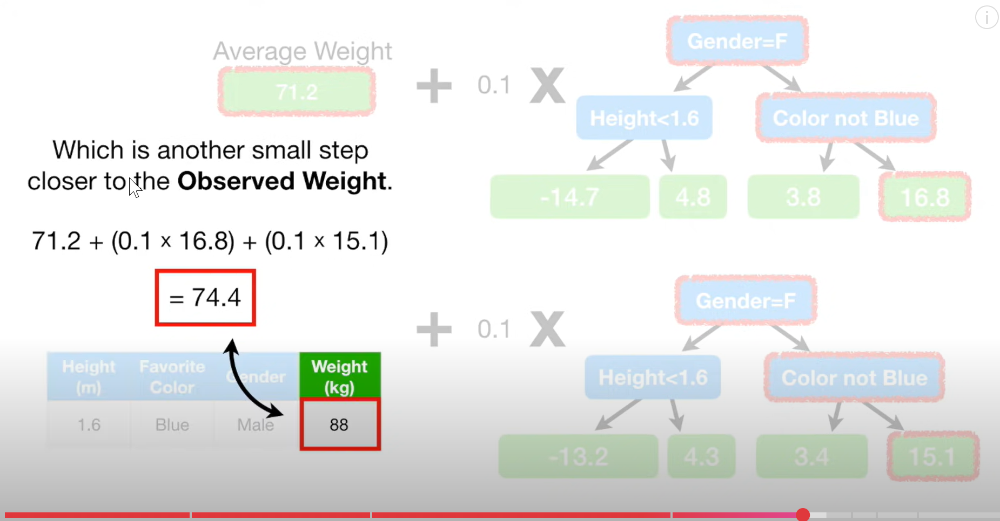  
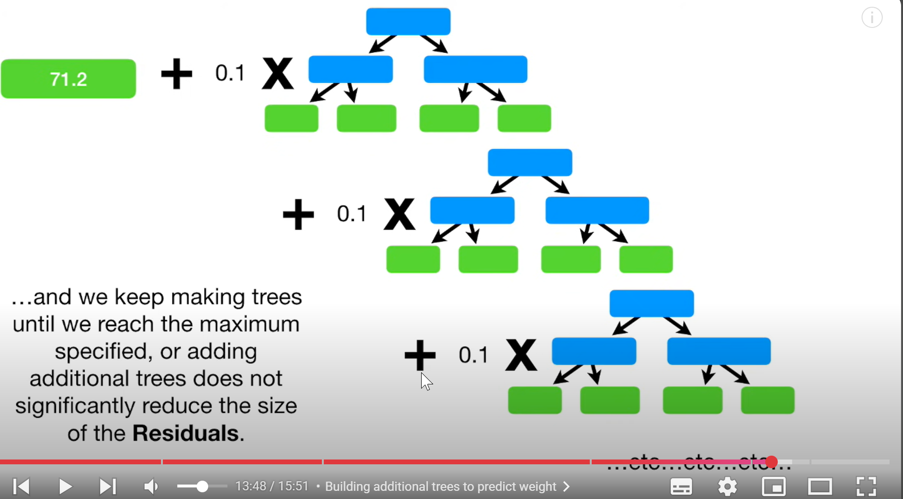

---

> ✅ That’s Gradient Boosting in action — an additive model built sequentially to minimize the residual error at each step.

## XGBoost 

Just more advance version of GBDT in that it apply regularization and tree pruning and other things.
[StatQuest](https://www.youtube.com/watch?v=OtD8wVaFm6E&list=PLblh5JKOoLULU0irPgs1SnKO6wqVjKUsQ&ab_channel=StatQuestwithJoshStarmer)


## GBDT for Feature Extraction and Feature reduction

Great follow-up! Let’s break down how **decision tree-based algorithms** are used for **feature reduction** and **feature extraction**, two slightly different concepts:

---

## 🌟 1. **Feature Reduction (Feature Selection)**

This means **removing irrelevant or redundant features** from your dataset. Tree-based models help with this in the following ways:

### ✅ **How it works**:
- Train a **decision tree model** (or a forest/boosted model).
- Get the **feature importances** (e.g., `.feature_importances_` in scikit-learn).
- **Set a threshold** (e.g., keep only top-k features or those above a certain importance score).
- Drop the less important features from your dataset.

### 🧠 Why it works:
- Tree-based models naturally focus on features that **split the data well**, so features that aren’t used much (or at all) are likely not helpful.
- It reduces **dimensionality**, speeds up model training, and can help avoid overfitting.

### 📌 Example:
```python
from sklearn.ensemble import RandomForestClassifier
from sklearn.feature_selection import SelectFromModel

rf = RandomForestClassifier()
rf.fit(X_train, y_train)

# Automatically reduce features based on importance threshold
selector = SelectFromModel(rf, threshold="mean", prefit=True)
X_train_reduced = selector.transform(X_train)
```

---

## 🧬 2. **Feature Extraction (Constructing New Features)**

This means **creating new features** based on the structure of the model itself, especially with decision trees and tree ensembles.

### 🌳 Tree-Based Feature Extraction Techniques:

#### A. **Tree Path Features** (Embedding from Leaf Indices)
- You run your data through the trained trees and **record the leaf node index** for each sample in each tree.
- These leaf indices can be **one-hot encoded** or embedded into vectors.
- This creates a new, dense representation of the original features.

#### 💡 Used in:
- **Gradient Boosted Decision Tree + Logistic Regression**
- **XGBoost + Linear Models**
- Kaggle competitions & production pipelines

```python
import xgboost as xgb

model = xgb.XGBClassifier()
model.fit(X_train, y_train)

# Extract leaf indices (each sample’s path in each tree)
leaf_indices = model.apply(X_train)

# One-hot encode or use directly as features for downstream model
```

#### B. **Stacking with Tree Outputs**:
- Train a tree-based model to **learn non-linear patterns**, then feed its output (probabilities or leaf-based features) into another model like logistic regression or neural networks.

---

## 🔁 Feature Reduction vs Feature Extraction – Quick Recap:

| Aspect                | Feature Reduction                          | Feature Extraction                          |
|-----------------------|---------------------------------------------|---------------------------------------------|
| Goal                 | Remove irrelevant features                  | Create new informative features             |
| Output               | Subset of original features                 | New feature representation                  |
| Tree Role            | Provide feature importance                  | Provide structural info (e.g., leaf nodes)  |
| Typical Tool         | Random Forest, XGBoost, LightGBM            | XGBoost, LightGBM with `.apply()`           |

---

Want a full code demo using XGBoost or scikit-learn for both reduction and extraction?


### GPT version summary


Here's your complete intuition-first **revision notes** for all major **tree-based algorithms**:  
✅ **Decision Tree**, 🌲 **Random Forest**, ⚡ **AdaBoost**, 🌄 **Gradient Boosting**, and 🚀 **XGBoost**  
— with examples, diagrams, and tables to build a deep understanding.

---

# 🌳 1. Decision Tree

### ✅ Basic Idea:
A decision tree **splits data** into subsets based on feature values to create **pure leaves** (i.e., each node has mostly one class or similar values).

### 🧠 Key Concepts:
- Uses **recursive binary splits**.
- Selects the "best" feature at each node using metrics like:
  - **Gini Impurity** (used in CART)
  - **Entropy / Information Gain** (used in ID3/C4.5)
- **Greedy algorithm**: makes the best local decision at each split.

### 🌱 Example:

Imagine classifying fruits based on size and color:

```
                [Is Color = Green?]
                /               \
            Yes                  No
         [Size > 3?]         [Class: Apple]
         /        \
    Yes           No
[Class: Mango]   [Class: Grapes]
```

### 📊 Comparison Table:

| Pros                          | Cons                              |
|-------------------------------|------------------------------------|
| Easy to interpret             | Overfits easily                   |
| No feature scaling needed     | Unstable to small data changes    |
| Works with both types         | Not very accurate alone           |

---

# 🌲 2. Random Forest

### ✅ Basic Idea:
An ensemble of **many decision trees** trained on **random subsets** of data and features.

- Each tree votes and the **majority class (classification)** or **average prediction (regression)** is used.

### 🧠 How It Improves Decision Trees:
| Feature      | Why It Helps             |
|--------------|--------------------------|
| Bagging      | Reduces variance         |
| Random Features | Adds decorrelation between trees |
| Ensemble     | Smoothens predictions    |

### 🌲 Visualization:

Imagine building 3 trees like this from bootstrapped data:
```
Tree 1 → 🍎  
Tree 2 → 🍌  
Tree 3 → 🍎  
Final Vote = 🍎
```

### 📊 Comparison Table:

| Pros                          | Cons                            |
|-------------------------------|----------------------------------|
| High accuracy                 | Slower to predict                |
| Handles missing data          | Not easily interpretable         |
| Feature importance available  | Large models = more memory       |

---

# ⚡ 3. AdaBoost (Adaptive Boosting)

### ✅ Basic Idea:
- Train **weak learners** (usually shallow trees).
- At each step, **increase weights** on misclassified samples.
- Focus future learners on **“hard” samples**.

### 🧠 Intuition:
Each learner corrects the previous one's mistakes.

### 🎯 Example:
```
1st tree: Misclassifies A, C  
→ Boost A & C's weight

2nd tree: Focuses more on A, C  
→ Misclassifies B  

3rd tree: Focuses more on B  
→ Final prediction: weighted vote
```

### ⚖️ Final prediction is a **weighted sum** of all learners.

### 📊 Comparison Table:

| Pros                      | Cons                         |
|---------------------------|-------------------------------|
| Works well on imbalanced data | Sensitive to noisy data      |
| Boosts weak learners       | Sequential → can't parallelize |
| Often better than random forests on tabular data | May overfit if too many rounds |

---

# 🌄 4. Gradient Boosting

### ✅ Basic Idea:
Like AdaBoost, but instead of adjusting weights, each learner fits to the **residual errors** (i.e., the difference between actual and predicted values).

### 🧠 Steps:
1. Predict mean value (first model).
2. Compute residuals:  
   \[
   \text{residual} = y - \hat{y}
   \]
3. Train next tree to **predict residuals**.
4. Add that tree’s output to previous predictions.

### 📉 Example:
| Round | Model Output | Residual      |
|-------|---------------|---------------|
| 0     | 10 (mean)     | Actual - 10   |
| 1     | +2            | Actual - 12   |
| 2     | +1.5          | Actual - 13.5 |

Final prediction:  
\[
\hat{y} = 10 + 2 + 1.5 = 13.5
\]

### 📊 Comparison Table:

| Pros                         | Cons                          |
|------------------------------|-------------------------------|
| Very accurate                | Slower than random forest     |
| Handles non-linear patterns  | Needs careful tuning (learning rate, depth) |
| Can be regularized           | Can overfit on small data     |

---

# 🚀 5. XGBoost (Extreme Gradient Boosting)

### ✅ Basic Idea:
An **optimized version of Gradient Boosting** with:
- **Regularization (L1 & L2)**
- **Tree pruning**
- **Parallelization**
- **Efficient memory usage**

### 🚧 Improvements Over Vanilla GBM:
| Feature             | Why it matters                          |
|---------------------|------------------------------------------|
| Regularization      | Reduces overfitting                     |
| Pruning (best-first)| Faster & better trees                   |
| Histogram-based split | Faster with large data                |
| Sparse-aware        | Handles missing values well             |
| GPU support         | Scalable for big datasets               |

### 🔍 Diagram (Simplified):
```
Boosting Round 1 → Learns residuals
Boosting Round 2 → Learns new residuals
…
Final Prediction = Sum of Trees
```

---

### 📊 Final Comparison Summary:

| Model        | Key Idea                              | Accuracy | Speed | Overfit Risk | Interpretability |
|--------------|----------------------------------------|----------|-------|---------------|------------------|
| Decision Tree | Split data recursively                 | Medium   | High  | High          | High             |
| Random Forest| Bagging + random feature selection     | High     | Medium| Low           | Medium           |
| AdaBoost     | Boosting by reweighting errors         | High     | Slow  | Medium        | Low              |
| GBM          | Boosting by fitting residuals          | Very High| Slow  | High          | Low              |
| XGBoost      | Regularized, optimized GBM             | Very High| Fast  | Low/Medium    | Low              |

---

Would you like a cheat sheet version of this with visuals and color-coded highlights for your revision PDF?
