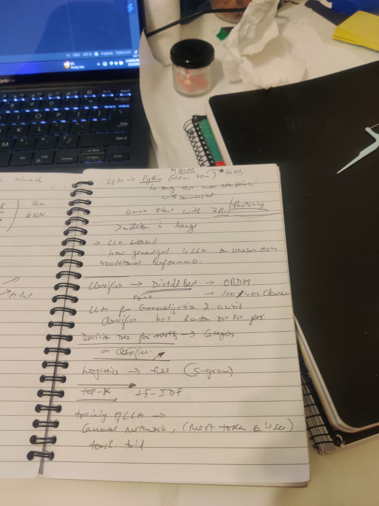

Notes from Talk with Risav





Abhishek Notes:


# About project
Discussion with Abhishek and Risav on the project.
The project has a sensor-name which is written with combination of different things it is related to. Post the sensor has been mapped during the sensor discovery process they have to be mapped to the device and equipment they are part off.
    sensor-name: <ServerName> <Equipment Type> <zone> <sensor-type>
    server-name: is the hardware device it is streaming data too
    Equipment-type: AHU/VAV/DUCT etc., it is connected too
    zone: virtual location of the sensor in the system
    sensor-type can be : ZNT: zone temperature, OCC: occupied, OAT: outside air temp, Humidity, CO2 etc.
The problem is to predict: equipment-type and sensor-type from this, which will greatly reduce the possibility of equipment it can be mapped to, A human worked has to little work to figure that out. Moreover, model will learn to adapt to different vendors and nomenclature used from different vendors which is difficult for all worker to know.

The Project was about finding the device-type, location, sensor_type, equipment_type from a given sensor name.
This information was used to filter the menu to map the given sensor to given device in sensor discovery process.
The basic problem arises because sensor coming from different provider and being marked by different person can have different name as there is no specification on how to name it.
The name itself contains the basic info about the type of equipment it is part of and type of sensor it is but it is not clear.
To make it unambiguous, we have LLM to convert the given asset point/sensor name to its parent id.

In project start we used the classification model like regression that was trained on the sensor name to predict the device and equipment it is part off. But the model was not able to predict the device and equipment correctly on unseen data. It has been trained on very small dataset of sensor while the name can come from different provider and can be named differently.
We needed a model that has understanding of language and can predict the device and equipment correctly. We used the Pythia model for this purpose.


# How it works:
1. A prompt given to the model which has sensor name, and it is asked to output sensor type from the 500 categories and equipment-type.
2. This model was fine-tuned on a refined dataset which has all this info already available. Model worked with 90% accuracy in this dataset.
3. The problem was to adapt to new data and train model continuously to refine on new data. 
4. For this we implemented the RLHF using DPO and PPO strategy. When the person mark the prediction of the model incorrect it was saved and model was trained later to perform on that using the DPO and PPO.
5. Later on we Developed the model-observability (using evidently) for data-drift and model performance on that. For that different matrices like 
6. Model Explainability using tensor. gradient were used to showcase part of the asset which were responsible for highest activation in output.


### later development
1. In later development we also went on to detect equipment-type. When we know which all sensors are mapped to a given device we can use this info to tell what kind of equipment is that.
2. We uses hot-encoded vector info like tf-idf of equipment with 500 features of different sensors.
3. This vector was fed to Decision-tree and equipment category out of 25s were predicted.


The project was called ROBOT' Rapid OpenBlue onboarding Tool

## Some pointers
1. There was a tradeoff in pythia (32m, 410m, 1.2B) vs Distil-bert, distil-bert was relatively small and can be run on the cpu itself.
2. DPO + distil-bert works best, 
3. FOr DPO + PPO(RLHF) we used some hugging face library. RLHF is also called PPO.
Steps 

1. We have take the Pythia 70m - 210m model, which was open source for commercial use and fine tune it on this specific problem to output the four fields of interest.
[This course](https://www.deeplearning.ai/short-courses/finetuning-large-language-models/), [its jupyter](https://github.com/pelinbalci/LLM_Notebooks/blob/main/LLM_Finetuning.ipynb), 
[Article on it](https://medium.com/@balci.pelin/llm-finetuning-410e8a2738ef)
This is basic step, which uses Tokenizer and Transformer from hugging face to load and fine tune the model. It also uses model evaluation from evaluator from hugging face to report BELU score and other important scores.
2. For this custom tokenizer was created that split the name of the device in varied length from 2-5 char and feed it LLM.


3. Handle the model observability part:
   - For These uses the Pytorch Gradient explainability part. - Read about this, implement this 


4. use of DistilBert, Decision Tree, or any other pre or post processor.


# Addressing Data Drift in production
[Article on Observability](https://medium.com/@pranavk2208/detecting-data-drift-using-evidently-5c8643fd382d)
1. Used `Evidently` for detecting data drift 
2. Matrix like KL-divergence, Jensen-Shannon Divergence or JS Divergence, Refer in the later section below for more details.
3. Question: How exactly was it used? What was the matrices being tracked?

Story: We used evidently to observe any data drift and model predictions errors. There were multiple matrix we had defiend for this
1. Inputs distribution Change: token distribution in our inputs, inputs were tokenize and we expect their n-gram to follow a distribution and when it varies from a ground distribution (KL- divergence) it raises an alert.
2. Output Token distribution: same for output token
3. model prediction changes: Observing model accuracy and error rates.
4. text_length, non_letter_character, Out_of_Vocab word count, are different matrices evidently provides for this oob.
5. We had created frequency distribution of (like tfidf) of our whole vocab.
[Read Article-1](https://medium.com/towards-data-science/understanding-kl-divergence-f3ddc8dff254) 
[Read Article-2](https://www.evidentlyai.com/blog/tutorial-detecting-drift-in-text-data)


# More About Pythia 

### FineTuning LLMs
[Pythia-LoRA based  finetuning ](https://www.youtube.com/watch?v=eC6Hd1hFvos&ab_channel=ShawTalebi)
[Aritcle of This video](https://towardsdatascience.com/fine-tuning-large-language-models-llms-23473d763b91/?sk=fd31e7444cf8f3070d9a843a8218ddad)

[Without LoRA finetuning Article](https://medium.com/myorder/fine-tuning-pythia-70m-deduped-instruction-following-llms-with-performance-evaluation-3bd0bb33b79)


# About DPO and PPO (RLHF)

### PPO
Step-1: We have a pre-trained model, which we fine-tune and the last step of it all is RLHF or DPO.


Step-2: Part of the strategy is to reduced human interference as much as possible, so we use a model that works as a human in feedback
Policy: The desired behaviour in model.
Reward Model: Separate model that scores or ranks outputs


Preference data train the reward model.
Instruct-tune-model is our model , which we copy and use to generate output, our reward model score that output and provide PPO which are used to update the policy model
Please note the penalty for KL-divergence to avoid gimmick the reward itself.


Challenges: unstable, lots of moving parts, Time-consuming, Expensive, Human preference varies. 

### DPO 
[RLHF and DPO explained Mathematically](https://www.youtube.com/watch?v=hvGa5Mba4c8&ab_channel=UmarJamil)
[simple tutorial By Hugging face on it](https://huggingface.co/docs/trl/main/en/dpo_trainer#trl.DPOTrainer.model_init)
key being without explicit reward modeling or reinforcement learning. Don't require training a reward model for this.


Way simpler, Faster, More reliable, Better Performance, responds consistently to high temp


This still requires human labeled preference data, preference can still vary


# About Data-Drift Matrices

Data drift matrices like **Kullback-Leibler (KL) Divergence** and others help quantify how much the distribution of data has changed over time, which is essential in monitoring machine learning models for concept drift. Here are some key methods:

### 1. **Kullback-Leibler (KL) Divergence**  
   - Measures how one probability distribution \( P \) differs from a reference distribution \( Q \).  
   - Formula:  
     ```math
      D_{KL}(P || Q) = \sum_{i} P(i) \log \frac{P(i)}{Q(i)}
      ```
   - **Pros**: Works well for categorical data and probability distributions.  
   - **Cons**: Not symmetric $ D_{KL}(P || Q) \neq D_{KL}(Q || P) $, and requires $ Q(i) > 0 $ for all \( i \).  

### 2. **Jensen-Shannon (JS) Divergence**  
   - A symmetric version of KL divergence that also ensures finite values.  
   - Formula:  
     
   ``` math
     D_{JS}(P || Q) = \frac{1}{2} D_{KL}(P || M) + \frac{1}{2} D_{KL}(Q || M)  
   ```

 where $ M = \frac{P + Q}{2} $.  
   - **Pros**: Symmetric and always finite.  
   - **Cons**: More computationally expensive than KL divergence.  

### 3. **Wasserstein Distance (Earth Mover’s Distance - EMD)**  
   - Measures how much "work" is required to transform one distribution into another.  
   - Particularly useful for continuous distributions and numeric data.  
   - **Pros**: Works well for structured, numeric data.  
   - **Cons**: Computationally expensive for high-dimensional data.  
 

### 4. **Population Stability Index (PSI)**  
   - Measures drift in categorical or continuous variables.  
   - Formula:  
     ```math
     PSI = \sum (P(i) - Q(i)) \log \frac{P(i)}{Q(i)}
     ```
   - **Pros**: Common in credit risk and business analytics.  
   - **Cons**: Less informative for small sample sizes.  

Would you like help implementing any of these in Python?


What is QLoRA and PEFT? [source](https://www.youtube.com/watch?v=eC6Hd1hFvos&ab_channel=ShawTalebi)
QLoRA : Low Rank Adaptation
PEFT: Parameter Efficient Fine Tuning

There are three ways to fine tune the model, the last one is PPO but it requires to train a reward model which in itself is a complex task.


So We do DPO, and then we do PEFT, which is a low rank adaptation of the model.
There are three ways for that also
1. Traing all the parameters of the model (costly)
2. Train only the attention heads (costly)
3. Add new Weight to the model (shown in light grey below)


## QLoRA

Original method of doing fine-tuning without LoRA. We have millions of parameters to train.


In LoRA we train only A and B and the r (rank of the model) can be very small. so the training parameter are small and we are able to match the output size of W. 


