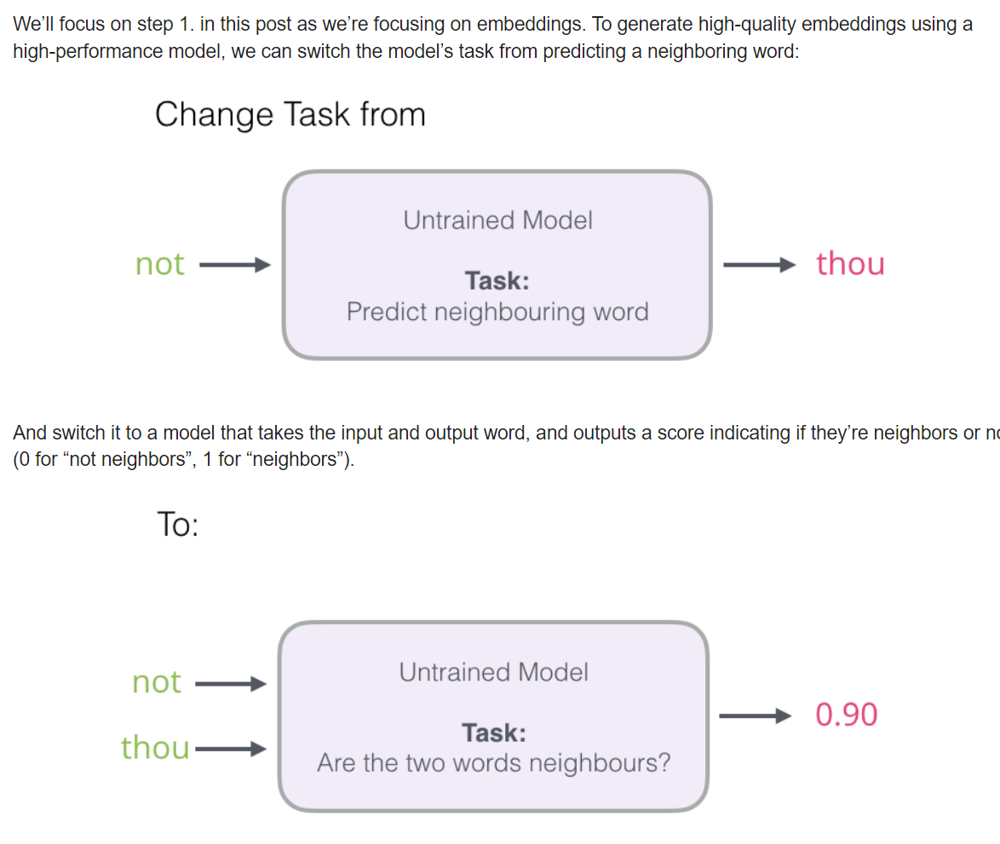
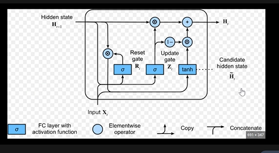

# All Resources for Basic Revision

1. [Krish Naik Deep Learning Series](https://www.youtube.com/watch?v=JkeiEYkLEvM&list=PLZoTAELRMXVPGU70ZGsckrMdr0FteeRUi)
2. [Deeplearning.ai by AndrewNG Notes](https://github.com/mbadry1/DeepLearning.ai-Summary)
3. [DeepLearning.ai by AndrewNG videos](https://www.youtube.com/watch?v=zQY2YvkMbHI&list=PLkRLdi-c79HKEWoi4oryj-Cx-e47y_NcM&ab_channel=MakingTARS)
4. [DeepLearning course Itself](https://www.coursera.org/specializations/deep-learning?authMode=login#courses) -- Login with facebook Account
4. [Same list of topic ensembled](https://towardsdatascience.com/how-id-learn-data-science-if-i-could-start-over-2-years-in-b821d8a4876c)
5. [master doc](https://docs.google.com/document/d/1wvtcwc8LOb3PZI9huQOD7UjqUoY98N5r3aQsWKNAlzk/edit)
6. [ML Compiled](https://ml-compiled.readthedocs.io/en/latest/index.html)

# All Machine Learning Algorithms :

1. [All at once](https://www.analyticsvidhya.com/blog/2017/09/common-machine-learning-algorithms/)
    1. [Linear Regression](https://towardsdatascience.com/step-by-step-tutorial-on-linear-regression-with-stochastic-gradient-descent-1d35b088a843)
    2. Logistic regression 
        1. [Assumptions](https://medium.com/@dhiraj8899/top-5-assumptions-for-logistic-regression-96b11d24d357)
    3. [ANN]()
    4. [CNN]()
    5. [KNN k nearest neighbour](https://www.analyticsvidhya.com/blog/2018/03/introduction-k-neighbours-algorithm-clustering/) : See the class of k neighbour for the point to predict Y and whatever be in te majority is thw winner.
    6. [K-Means Clustering](https://www.youtube.com/watch?v=4b5d3muPQmA): create k cluster and assign each point to either one of them.
    K is optimized based on elbow in the distance summation from cluster centroid
    7. [Naive Bayes](https://monkeylearn.com/blog/practical-explanation-naive-bayes-classifier/)
    1. [Decision Tree/Random Forest Detailed](https://www.analyticsvidhya.com/blog/2016/04/tree-based-algorithms-complete-tutorial-scratch-in-python/)
        1. [Decide Splitting of tree]()
            1. Gini  (p^2+ q^2x)
            2. Information Gain -pLogp-qLogq
            3. chi-square : ((Actual – Expected)^2 / Expected)^1/2
        2. Constrain :
            1. Minimum samples for noe split
            2. minimum sample for leaf nodes
            3. maximum depth
            4. maximum number of terminal Node
            5. maximum feature for splitting
        3. Prunning.. Deciding the spliting feature by going in 2-3 level depth and see the behaviour. 
        1. [Boosting In Ml](https://www.analyticsvidhya.com/blog/2015/11/quick-introduction-boosting-algorithms-machine-learning/)
            1. [ADABost (adaptive bosting) Visulaized](https://www.youtube.com/watch?v=LsK-xG1cLYA&ab_channel=StatQuestwithJoshStarmer) and [By Krish Nair](https://www.youtube.com/watch?v=NLRO1-jp5F8&t=447s&ab_channel=KrishNaik):  a stump based on multiple features and collective output is answer : weightage of stump is different 
            amount of say
            AOS = 1/2*log((1-TotalError)/TotalError) newWieght wrong = old*e^AOS
            newwight corect = old*e^(-AOS)
            2. [Gradient Boost by Krish Nair](https://www.youtube.com/watch?v=Nol1hVtLOSg&ab_channel=KrishNaik)
    2. [SVM](https://towardsdatascience.com/svm-implementation-from-scratch-python-2db2fc52e5c2)
        1. [kernel Function intution](https://towardsdatascience.com/kernel-function-6f1d2be6091)
        2. [kernal Function clearly Demonstrated](https://www.youtube.com/watch?v=Qc5IyLW_hns&ab_channel=StatQuestwithJoshStarmer)

    2. ## Dimensionality reductions : Feature selections 

        1.  [PCA 1](https://builtin.com/data-science/step-step-andexplanation-principal-component-analysis) and [PCA 2 ](https://towardsdatascience.com/a-one-stop-shop-for-principal-component-analysis-5582fb7e0a9c) and [SVD(Singular value decomposition)](https://www.youtube.com/watch?v=P5mlg91as1c&ab_channel=ArtificialIntelligence-AllinOne) 
        Theme here is PCA is performed by SVD like to do PCA we use SVD methods
       2. [PCA from scratch](https://towardsdatascience.com/principal-component-analysis-pca-from-scratch-in-python-7f3e2a540c51)
       3. Non-linear Dimensionality reduction -- Kernel
            1. [t-SNE](https://towardsdatascience.com/an-introduction-to-t-sne-with-python-example-5a3a293108d1) t-distributed Stochastic neighbour embedding [statQuest](https://www.youtube.com/watch?v=NEaUSP4YerM&ab_channel=StatQuestwithJoshStarmer) :
            > it basically take the clustering in higher dimension and project/presrve the same when projected to lower dimension allowing us to view the relationship in data. Used in word-embedding in NLP.
            its computationally very expensive.


# Important Concept in DeepLearning 
1. [Data Science Interview MindSet by Krish Naik](https://www.youtube.com/watch?v=613lId6jm7g&ab_channel=KrishNaik)
2. [Topics to Prepare Krish nair](https://www.youtube.com/watch?v=8Q5F_AQ9OGo&ab_channel=KrishNaik)
4. [Full Implmentation of ANN](https://www.youtube.com/watch?v=OTTOglLJxLU&list=PLZoTAELRMXVPGU70ZGsckrMdr0FteeRUi&index=17)
5. [Weight Initialization video](https://www.youtube.com/watch?v=tMjdQLylyGI&list=PLZoTAELRMXVPGU70ZGsckrMdr0FteeRUi&index=11&ab_channel=KrishNaik) and [article](https://towardsdatascience.com/weight-initialization-in-neural-networks-a-journey-from-the-basics-to-kaiming-954fb9b47c79)
    1. Zero Initializarion : all Zeros not for ANN
    2. Randome Initialization : np.rand.random
    3. Xavier/Gorat Initialization : root(2/fan_in+fan_out) works well with sigmoid
    4. He_ Initialization : Works well with RELU Activation
5. [Regularization](https://github.com/mbadry1/DeepLearning.ai-Summary/tree/master/2-%20Improving%20Deep%20Neural%20Networks#regularization) : Reducing overfitting and underfitting
    1. [L1](https://towardsdatascience.com/intuitions-on-l1-and-l2-regularisation-235f2db4c261)
    2. [L2s ](https://towardsdatascience.com/l1-and-l2-regularization-methods-ce25e7fc831c)
    3. Dropout
    4. Data Augementation
    5. Early Stopping

6. [Optimization deeplearning.ai](https://github.com/mbadry1/DeepLearning.ai-Summary/tree/master/2-%20Improving%20Deep%20Neural%20Networks#optimization-algorithms) :
    1. [Momentum based](https://github.com/mbadry1/DeepLearning.ai-Summary/tree/master/2-%20Improving%20Deep%20Neural%20Networks#gradient-descent-with-momentum) : Exponential Moving average of DW and db term to stop them moving randomly 
    3. [RMS Prop (root mean square) ](https://github.com/mbadry1/DeepLearning.ai-Summary/tree/master/2-%20Improving%20Deep%20Neural%20Networks#rmsprop) : divide alpha with Sdw and Sdb and assume Sdb > Sdw so b will move in optimize manner
    4. [ADAM](https://github.com/mbadry1/DeepLearning.ai-Summary/tree/master/2-%20Improving%20Deep%20Neural%20Networks#adam-optimization-algorithm) : combinaion of Momentum and RMS prop
    5. [ADA Grad](https://www.youtube.com/watch?v=GSmW59dM0-o&list=PLZoTAELRMXVPGU70ZGsckrMdr0FteeRUi&index=15) : Kind of RMS prop but simple average of all past DW*DW so as number of 
    6. [Mini Batch Gradient Descent](https://github.com/mbadry1/DeepLearning.ai-Summary/tree/master/2-%20Improving%20Deep%20Neural%20Networks#mini-batch-gradient-descent)
    7. (Stochastic gradient Descent)[]

7. [Batch Normalization](https://github.com/mbadry1/DeepLearning.ai-Summary/tree/master/2-%20Improving%20Deep%20Neural%20Networks#normalizing-activations-in-a-network)
   1. [Behaviour for inferencing for Batch=1](https://github.com/mbadry1/DeepLearning.ai-Summary/tree/master/2-%20Improving%20Deep%20Neural%20Networks#batch-normalization-at-test-time)
8. [SoftMax Classifier](https://github.com/mbadry1/DeepLearning.ai-Summary/tree/master/2-%20Improving%20Deep%20Neural%20Networks#softmax-regression):
   1. [Softmax classifier in DL video By AndrewNG](https://www.youtube.com/watch?v=LLux1SW--oM&list=PLkDaE6sCZn6Hn0vK8co82zjQtt3T2Nkqc&index=31&ab_channel=DeepLearningAI)
   2. [Cross entropy Function](https://peterroelants.github.io/posts/cross-entropy-softmax/) = sum(Yc* Log Yc^) for all the classes
8. [batch Nomalization](https://github.com/mbadry1/DeepLearning.ai-Summary/tree/master/2-%20Improving%20Deep%20Neural%20Networks#normalizing-activations-in-a-network)
8. [Vanishing](https://www.youtube.com/watch?v=JIWXbzRXk1I&list=PLZoTAELRMXVPGU70ZGsckrMdr0FteeRUi&index=7) and [Exploding](https://www.youtube.com/watch?v=IJ9atfxFjOQ&list=PLZoTAELRMXVPGU70ZGsckrMdr0FteeRUi&index=8) gradient Descent [Andrew NG](https://github.com/mbadry1/DeepLearning.ai-Summary/tree/master/2-%20Improving%20Deep%20Neural%20Networks#vanishing--exploding-gradients) 
        > Note : video by Krish Nair has some technical glitches but it give good gist of it. Hint : it all depends on W.

    1. [Relu](https://www.youtube.com/watch?v=DDBk3ZFNtJc&list=PLZoTAELRMXVPGU70ZGsckrMdr0FteeRUi&index=10) to overcome vanishing problem this because slope =1 
    2. Exploding problem can be managed by adjusting for W and normalizing it
9. [Boosting techniques](https://blog.paperspace.com/adaboost-optimizer/)
    >These are generally decision tree based random forest but rather then tree being created independently, we create stomp one after another depending on the result of the previous one.
    Mainly 2 type : ADAboost, Gradient Boost, XGboost  
10. [Quatization](https://medium.com/@joel_34050/quantization-in-deep-learning-478417eab72b#:~:text=Quantization%20for%20deep%20learning%20is,cost%20of%20using%20neural%20networks.) 
    >Quantization for deep learning is the process of approximating a neural network that uses floating-point numbers by a neural network of low bit width numbers. This dramatically reduces both the memory requirement and computational cost of using neural networks
11. [Bottlenecking Basics](https://ai.stackexchange.com/a/4887)  and [Coverage By AndrewNG](https://github.com/mbadry1/DeepLearning.ai-Summary/tree/master/4-%20Convolutional%20Neural%20Networks#inception-network-googlenet):
    > Like we did in inception net to reduce the number of channel compute with a 1X1 channel before doing the actual computation.
12. [oversampling and under Sampling ](https://machinelearningmastery.com/random-oversampling-and-undersampling-for-imbalanced-classification/)
    >Random Oversampling: Randomly duplicate examples in the minority class.
    Random Undersampling: Randomly delete examples in the majority class.
13. Object Detection
    1. [All Backbone Networks Explained](https://youtu.be/xxHkbWMILjI?list=PLkRLdi-c79HKEWoi4oryj-Cx-e47y_NcM&t=1288)
        1. [Resnet](https://youtu.be/xxHkbWMILjI?list=PLkRLdi-c79HKEWoi4oryj-Cx-e47y_NcM&t=1288)
        2. [Inception](https://youtu.be/xxHkbWMILjI?list=PLkRLdi-c79HKEWoi4oryj-Cx-e47y_NcM&t=2267)
        3. [YOlO]()
        4. [EfficientNet - NAS (Neural archt search)](https://www.youtube.com/watch?v=GOxRSefbBoI&ab_channel=CodeWithAarohi)
        5. [EfficientDet - BiFPN](https://www.youtube.com/watch?v=OsA3zH5NKYc&ab_channel=CodeWithAarohi)
    2. [FPN - Feature Pyrmaid Network](https://github.com/potterhsu/easy-fpn.pytorch)
       1. [Understanding them](https://www.youtube.com/watch?v=mwMopcSRx1U&ab_channel=HaoTsui)
    3. [Region Proposal Networks-RPNs](https://www.youtube.com/watch?v=if1tzf1p0gA&ab_channel=CodeWithAarohi)
    3. Faster-R-CNN - Region with CNN, how to find location of object using the CNN?
       1. [RCNN](https://towardsdatascience.com/r-cnn-for-object-detection-a-technical-summary-9e7bfa8a557c)
       2. [Fast-RCNN](https://towardsdatascience.com/fast-r-cnn-for-object-detection-a-technical-summary-a0ff94faa022)
       3. [Faster-RCNN](https://towardsdatascience.com/faster-r-cnn-for-object-detection-a-technical-summary-474c5b857b46)
# NLP Concepts
1. [Word Embeddings Notes by ANdrew NG](https://github.com/mbadry1/DeepLearning.ai-Summary/tree/master/5-%20Sequence%20Models#natural-language-processing--word-embeddings)
   1. [Word2Vec by Jay ](https://jalammar.github.io/illustrated-word2vec/) -- best for one go learning
      1. Using SKip-gram - tougher and complex
      2. Using Negative sampling - easy and less complex
      
   2. [confusing by ANdrewNG video](https://youtu.be/36XuT5c9qvE?list=PLkRLdi-c79HKEWoi4oryj-Cx-e47y_NcM&t=2575)
2. [Tf-TDF vectorization](https://towardsdatascience.com/tf-idf-for-document-ranking-from-scratch-in-python-on-real-world-dataset-796d339a4089)
   Using WHere we want to define our own word vector representation, or word2Vec is not to be used.
3. [Sequence Model and RNN Understanding by ANdrewNG](https://github.com/mbadry1/DeepLearning.ai-Summary/tree/master/5-%20Sequence%20Models#recurrent-neural-networks)
   1. [RNN, GRU and LSTM Understanding by ANdrewNG](https://github.com/mbadry1/DeepLearning.ai-Summary/tree/master/5-%20Sequence%20Models#recurrent-neural-network-model)
   2. [Seq2Seq model and using attention with them by Jay](https://jalammar.github.io/visualizing-neural-machine-translation-mechanics-of-seq2seq-models-with-attention/)
4. [Understanding Transformers by Kris](https://www.youtube.com/watch?v=MQnJZuBGmSQ&ab_channel=JayAlammar)
   1. [Article by JaiAlmmar](http://jalammar.github.io/illustrated-transformer/)


# Important Concept 
1. [A/B Testing 1 ](https://towardsdatascience.com/data-science-you-need-to-know-a-b-testing) and [2](https://medium.com/capital-one-tech/the-role-of-a-b-testing-in-the-machine-learning-future-3d2ba035daeb)
    > Type I error is committed when the null hypothesis is true and we reject it, 
    also known as a ‘False Positive’. Type II error is committed when the null
    hypothesis is false and we accept it, also known as ‘False Negative’
2. [Confusion matrix(precision/recalll)](https://towardsdatascience.com/understanding-confusion-matrix) and [Terminology](https://www.dataschool.io/simple-guide-to-confusion-matrix-terminology/)
2. [Precision Matrices](https://machinelearningmastePCry.com/tour-of-evaluation-metrics-for-imbalanced-classification/)
3. [Imbalanced classification Matrices](https://machinelearningmastery.com/tour-of-evaluation-metrics-for-imbalanced-classification/)
4. [ROC-AUC curve and PR curve](https://www.youtube.com/watch?v=4jRBRDbJemM)
5. [Precision Recall Curve](https://medium.com/@vijayshankerdubey550/evaluation-metrics-for-object-detection-algorithms-b0d6489879f3)
6. basic Statistics and test like ANOVA, p-test, f-test chi-square test etc

# To Do Task 
1. learn About big data tool like hadoop and their working, implement a simple project to get the output. Big, Hive, Hadoop Flume-- Big Data System. It is needed for retrieval and processing.
2. NLP
3. Reporting tools like tabelau, QlickView, PowerU
4. Model Deployment Techniques - Deploy and see if it is scalable or not 
5. Exploratory Data Analysis :
    1. Feature Designing 
    2. Feature Engineering 
    3. Feature Selection
    4. Model Creation
    5. Model Deployment
6. DevOps Things 
    1. Quebernet 
    2. Docker


# Ensemble learning 
Types Of Ensemble Methods
Ensemble Methods can be used for various reasons, mainly to:

```
Decrease Variance (Bagging)
Decrease Bias (Boosting)
Improve Predictions (Stacking)
```


## Good to have sample project

1. Recommendation Engine 
2. ANy NLP based project like covid one
2. map-reduce and hadoop basic knowledge 
3. basic knowledge of statistics and linear algebra
    1. Distribution : poisson, Gaussian etc
    2. Linear algebra : Eigen value calculations and concept
4. Usage of t-SNE, SVM, Bayes theorem, PCA for one problem. See for the Usage of SVM for feature selection in decision tree.
5. Usage of ROC(reciever operating characterstics) and PR curve in actual decision of good classifier.
6. Andrew Ng notes complete transcript along with slides.


Ensemble Methods can also be divided into two groups:

>Sequential Learners, where different models are generated sequentially and the mistakes of previous models are learned by their successors. This aims at exploiting the dependency between models by giving the mislabeled examples higher weights (e.g. AdaBoost).
Parallel Learners, where base models are generated in parallel. This exploits the independence between models by averaging out the mistakes (e.g. Random Forest).
Boosting in Ensemble Methods
Just as humans learn from their mistakes and try not to repeat them further in life, the Boosting algorithm tries to build a strong learner (predictive model) from the mistakes of several weaker models. You start by creating a model from the training data. Then, you create a second model from the previous one by trying to reduce the errors from the previous model. Models are added sequentially, each correcting its predecessor, until the training data is predicted perfectly or the maximum number of models have been added.

Boosting basically tries to reduce the bias error which arises when models are not able to identify relevant trends in the data. This happens by evaluating the difference between the predicted value and the actual value.

Types of Boosting Algorithms
1. AdaBoost (Adaptive Boosting)
2. Gradient Tree Boosting
3. XGBoost

In this article, we will be focusing on the details of AdaBoost, which is perhaps the most popular boosting method.


# choice of evaluation matrices 
>
>Here are some first-order suggestions: \
Are you predicting probabilities?\
    Do you need class labels? \
    Is the positive class more important? \
    Use Precision-Recall AUC \
    Are both classes important? \
    Use ROC AUC \
Do you need probabilities? \
Use Brier Score and Brier Skill Score\
Are you predicting class labels? \
Is the positive class more important? \
Are False Negatives and False Positives Equally Important? \
Use F1-Measure\
Are False Negatives More Important?\
Use F2-Measure\
Are False Positives More Important? \
Use F0.5-Measure \
Are both classes important? \
Do you have < 80%-90% Examples for the Majority Class? \ 
Use Accuracy \
Do you have > 80%-90% Examples for the Majority Class? \
Use G-Mean \


Sequence Model



